# {{page.title}} {#first-five-minutes}

In this chapter you will learn how to create a new Xtext project, generate a fully working language infrastructure, and how to start editors tailored to your language for testing. We show you how this works for editors based on the Eclipse IDE, IntelliJ IDEA, and web browsers.

But before we get started, make sure you have Eclipse Xtext properly [installed](../download.html). If you did not work with Eclipse yet you might want to choose the [Full Eclipse](../download.html) distribution, which you can unpack into the folder of your choice and run. Otherwise you may install Xtext via the Eclipseone of our [Update Sites](../download.html#updatesites) or the [Eclipse Market Place](http://marketplace.eclipse.org/content/xtext) into your existing Eclipse IDE, and continue [here](#new-project). If you're interested in Xtext's IntelliJ IDEA or web support you need to install [Buildship](http://projects.eclipse.org/projects/tools.buildship), too, which is available via the [Eclipse Marketplace](http://marketplace.eclipse.org/content/buildship-gradle-integration), as well.

After launching the Eclipse IDE you will be asked for a workspace directory, into which all the files and settings will be stored. You can start with the default proposal.

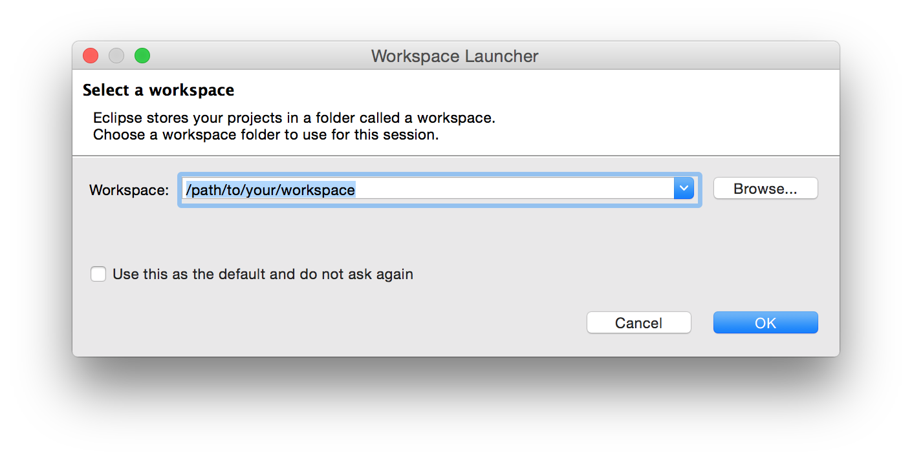

Once you confirmed your workspace the IDE will start with a welcome page. 

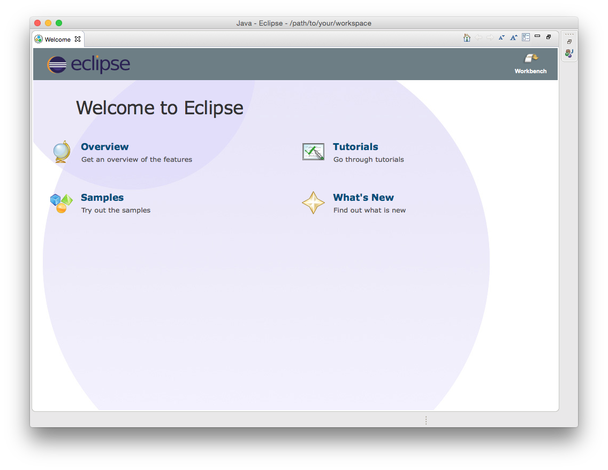

Close the welcome page via the cross handle in the *Welcome* tab in the top left corner of the window, and there you go: This is your IDE.

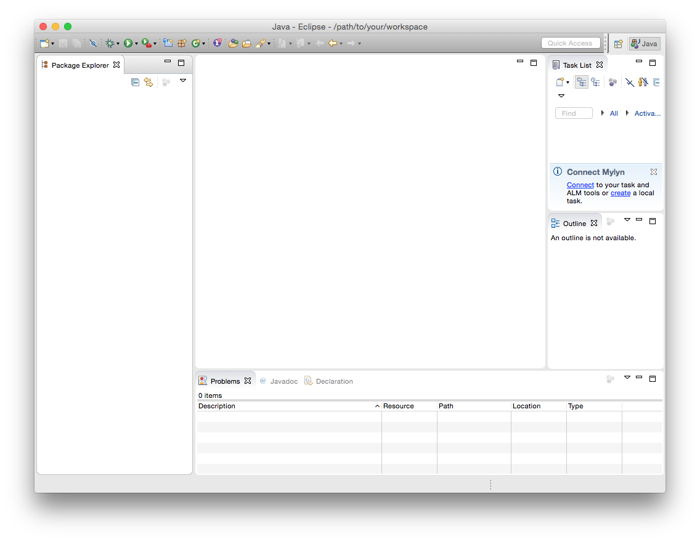


## Creating A New Xtext Project {#new-project}

Now create a new Xtext project by choosing *File &rarr; New &rarr; Project...* from the main menu. The dialog offers a couple of different project types. Select *New Xtext Project* from the category *Xtext*.
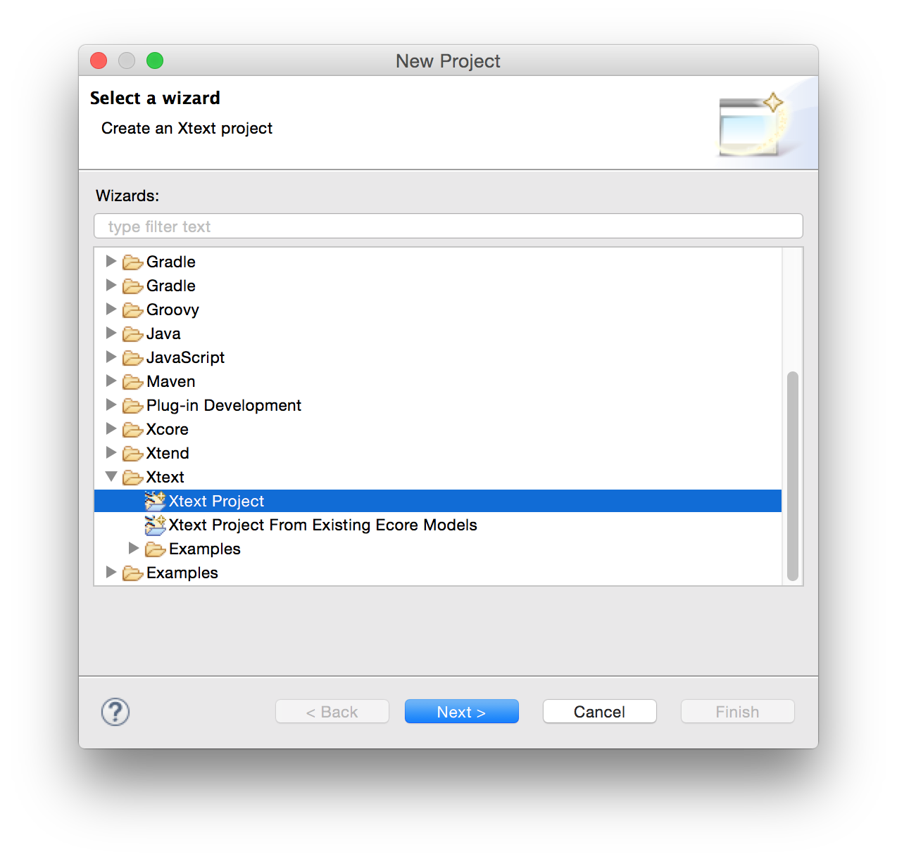

Keep the project and language names as proposed for the moment and continue via *Next*.
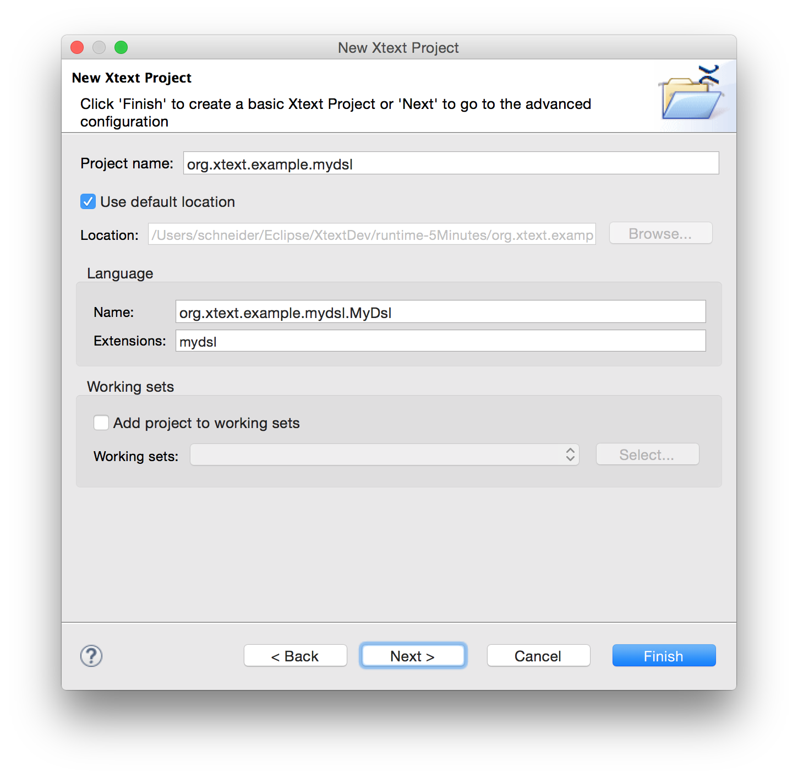

Feel free to select all of the offered *Facets*, choose the *Gradle* build system, and finish the wizard.
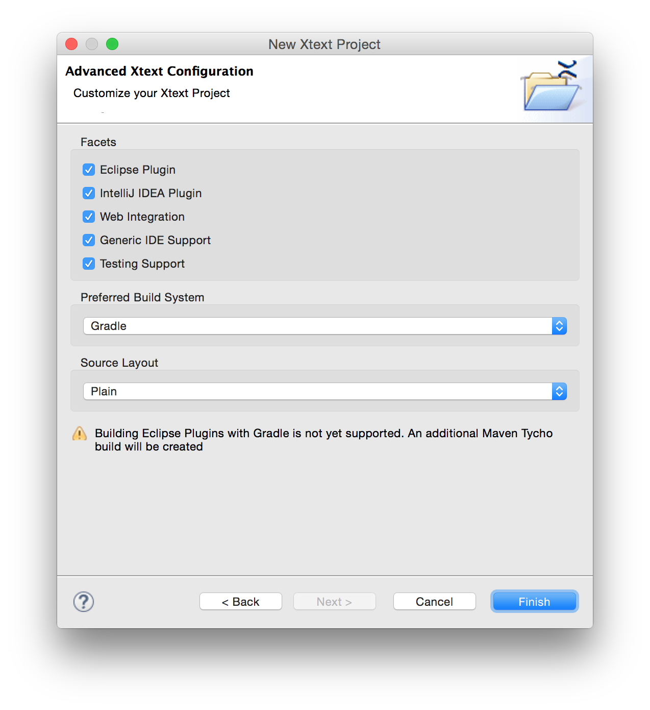

You will find 9 new projects in your workspace which are mostly empty. The Xtext grammar editor will be opened and show the definition of a very simple *Hello World* language.

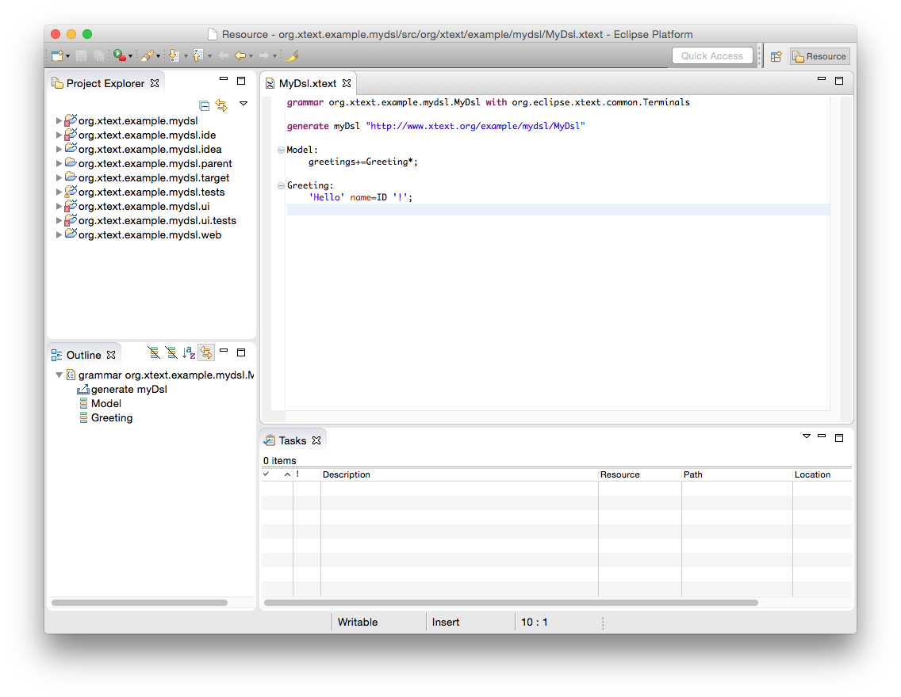

The only thing this language allows is to write down a list of greetings. The following would be proper input: 

```mydsl
Hello Xtext!
Hello World!
```

## Generating The Language Infrastructure {#run-workflow}

In order to test drive this language, you will have to generate the respective language infrastructure. Therefore, open the grammar editor's context menu and hit *Run As &rarr; Generate Xtext Artifacts*. A new Java process will be spawned, the *Console* view will appear, and afterwards you will find a couple of new files in the projects that were created by the project wizard.

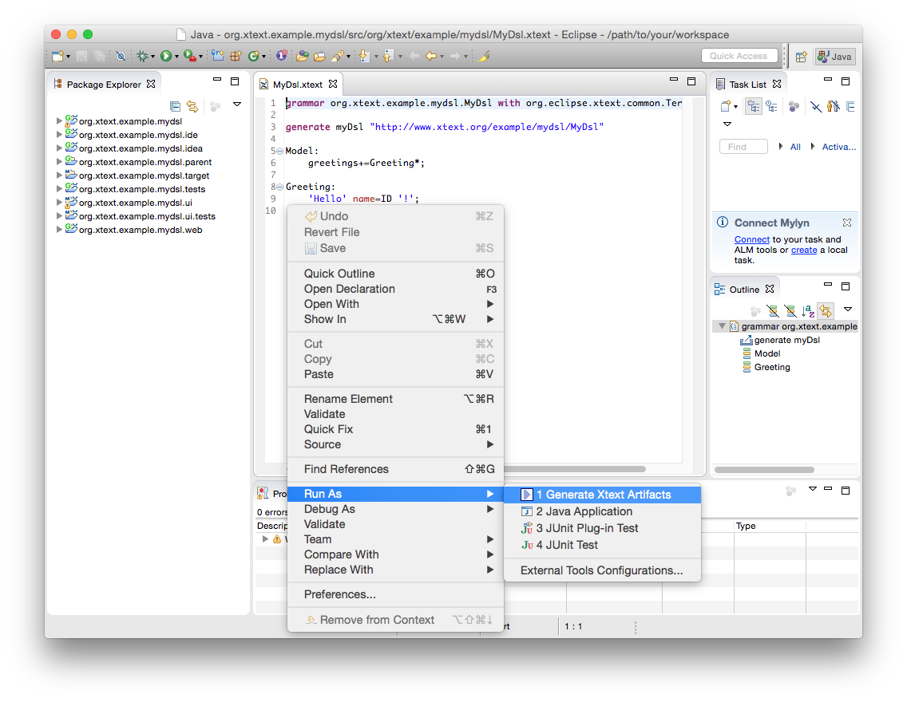

## Try The Eclipse Editor {#testing-eclipse-editor}

Let's give the editor a try. If you select *Run As &rarr; Eclipse Application* from the project's context menu. A new Eclipse IDE instance will be launched and allows to test drive the editor.

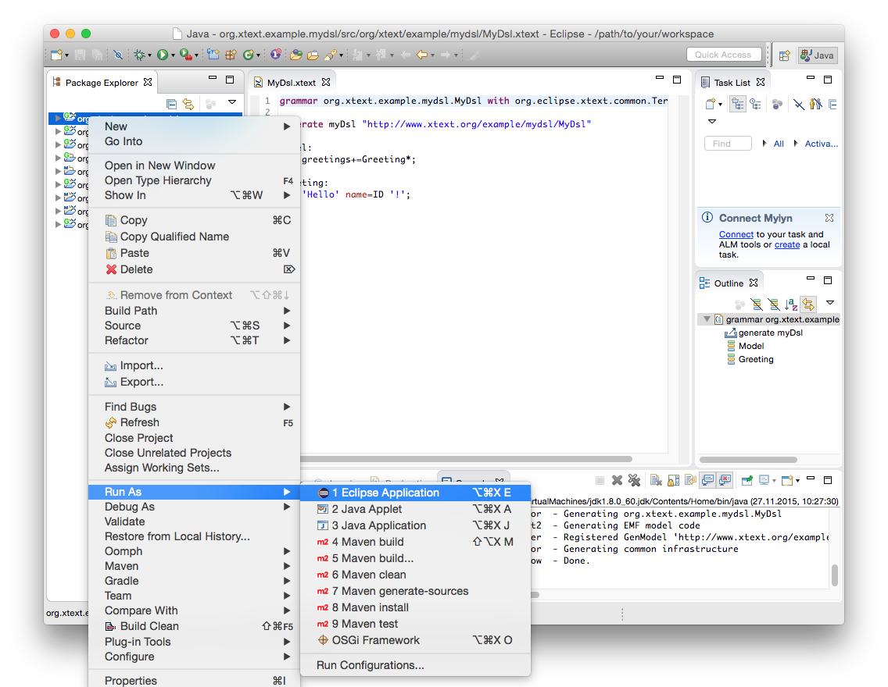

Before you can create a file for the sample language in the test IDE you need to close the welcome page, of course, and create a sample project. Select *File &rarr; New &rarr; Project...* and choose a project type of your choice, e.g. *Java Project*, name it *Sample* and create a new file in the *src* folder of the project: From the context menu of the folder choose *New &rarr; File*, call it *Sample.mydsl* and hit *Finish*. The newly created editor for your language will open and ask you in a dialog, whether you want to add the Xtext nature to your project, which you should confirm. You can now give the editor a try, e.g. use content assist (*Ctrl+Space*) to insert the keyword `Hello` and see how the input is validated immediately.

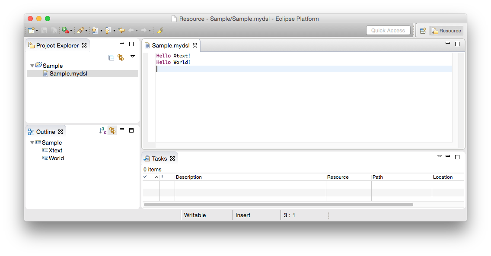

## Try The IntelliJ IDEA Editor {#testing-idea-editor}

The IDEA IDE can be launched by means of the Gradle build system. If you're using the prepared Full Eclipse IDE, Gradle integration is already available. Otherwise, make sure to have [Buildship](http://projects.eclipse.org/projects/tools.buildship) installed, which is available via the [Eclipse Marketplace](http://marketplace.eclipse.org/content/buildship-gradle-integration), for example.

Open the *Gradle Tasks* view via *Window &rarr; Show view &rarr; Other... &rarr; Gradle &rarr; Gradle Tasks*.
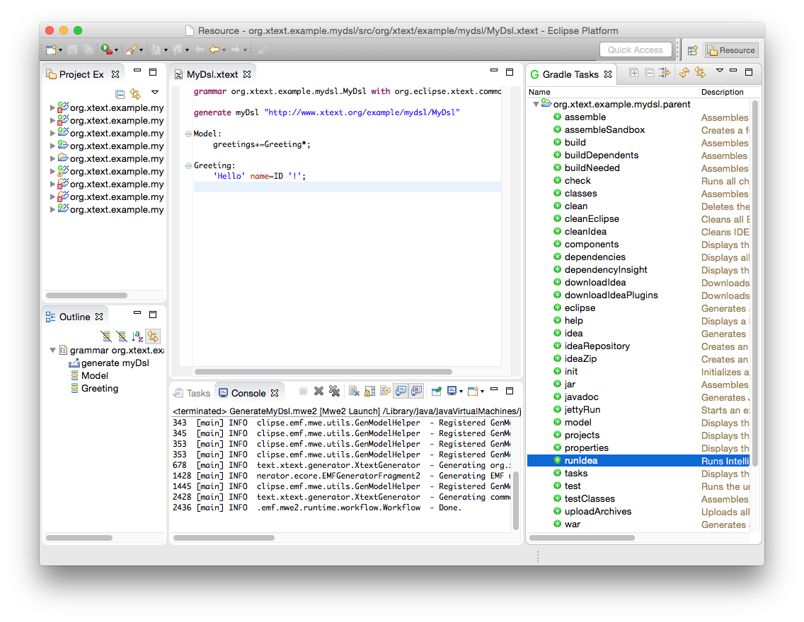

Expand the project `org.xtext.example.mydsl.parent` and double click on the task named `runIdea`. A bunch of required components is downloaded first, and after successful compilation an IDEA IDE is launched.


Create a new project, e.g., a Java project. You may skip the determination of the SDK to be used and proceed to the prompt of the project name.


Let's call the project *Sample*.


Once your project is set up create a plain file named *Sample.mydsl* in the *src* folder, and your DSL editor is opened. Enter the example text below, check out the content assist (*CTRL/CMD + Space*) as well as the live validation offered by the editor.

```mydsl
Hello Xtext!
Hello World!
```

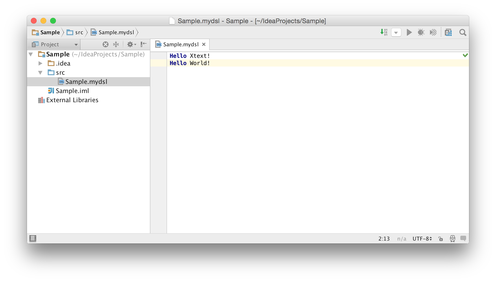

## Try The Web Editor {#testing-web-editor}

For testing the web editor a local web server needs to be started. That can be launched by means of the Gradle build system. If you're using the prepared Full Eclipse IDE, Gradle integration is already available. Otherwise, make sure to have [Buildship](http://projects.eclipse.org/projects/tools.buildship) installed, which is available via the [Eclipse Marketplace](http://marketplace.eclipse.org/content/buildship-gradle-integration), for example.

Open the *Gradle Tasks* view via *Window &rarr; Show view &rarr; Other... &rarr; Gradle &rarr; Gradle Tasks*.
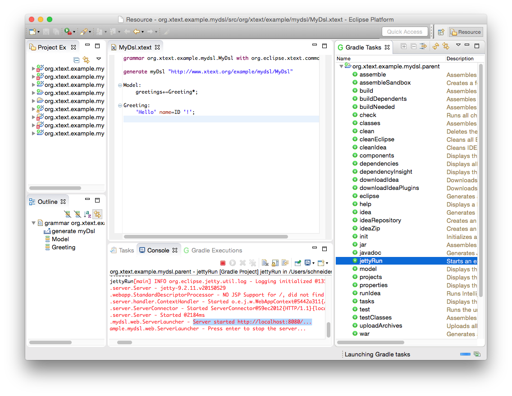

Expand the project `org.xtext.example.mydsl.parent` and double click on the task named `jettyRun`. A bunch of required components is downloaded first, and after successful compilation a Jetty web server is launched. It is accessible via the URL printed in the *Console* view.

Open that URL in your favorite browsers, click into the text field, and enter sample text

```mydsl
Hello Xtext!
Hello World!
```
Check out the content assist by hitting *Ctrl/Cmd + Space*.


To stop the web server click into the *Console* view of your development IDE and hit *enter/return*.

## Conclusion {#five-minutes-conclusion}

In your first five minutes with Xtext, you have learned how to create a valid set of projects for building editors for your DSLs. You have run Xtext's code generation in order to get a fully working language infrastructure, and finally learned how to test the generated editors.

Next up you should go through the more comprehensive [Domain Model Example](102_domainmodelwalkthrough.html). It explains the different concepts of the Xtext grammar language and illustrates how to customize various aspects of the language. 

---

**[Next Chapter: 15 Minutes Tutorial](102_domainmodelwalkthrough.html)**