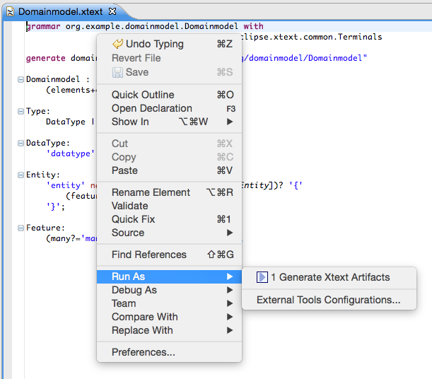
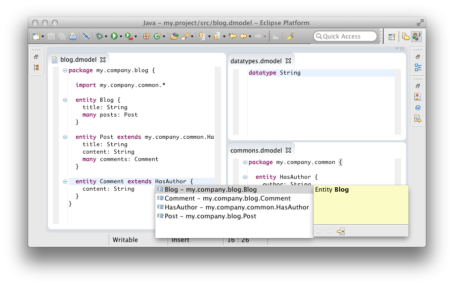

# {{page.title}} {#domain-model-walkthrough}

In this tutorial we will implement a small domain-specific language to model entities and properties similar to what you may know from Rails, Grails or Spring Roo. The syntax is very suggestive :

```domainexample
datatype String

entity Blog {
    title: String
    many posts: Post
}

entity HasAuthor {
    author: String
}

entity Post extends HasAuthor {
    title: String
    content: String
    many comments: Comment
}

entity Comment extends HasAuthor {
    content: String
}
```

After you have installed Xtext on your machine, start Eclipse and set up a fresh workspace.

## Create A New Xtext Project

In order to get started we first need to create some Eclipse projects. Use the Eclipse wizard to do so:

*File &rarr; New &rarr; Project... &rarr; Xtext &rarr; Xtext project*

Choose a meaningful project name, language name and file extension, e.g.

|:---|:---|
|**Project name:**|org.example.domainmodel|
|**Language name:**|org.example.domainmodel.Domainmodel|
|**Language extensions:**|dmodel|

Click on *Finish* to create the projects. 


After you have successfully finished the wizard, you will find five new projects in your workspace.

|:---|:---|
|org.example.domainmodel|The grammar definition and all language-specific components (parser, lexer, linker, validation, etc.)|
|org.example.domainmodel.tests|Unit tests for the language|
|org.example.domainmodel.ide|Platform-independent IDE functionality (e.g. services for content assist)|
|org.example.domainmodel.ui|The Eclipse editor and other workbench related functionality|
|org.example.domainmodel.ui.tests|Unit tests for the Eclipse editor|


## Write The Grammar

The wizard will automatically open the grammar file *Domainmodel.xtext* in the editor. As you can see it already contains a simple *Hello World* grammar:

```xtext
grammar org.example.domainmodel.Domainmodel with
                                      org.eclipse.xtext.common.Terminals

generate domainmodel "http://www.example.org/domainmodel/Domainmodel"

Model:
    greetings+=Greeting*;
  
Greeting:
    'Hello' name=ID '!';
```

Let's now just replace that grammar definition with the one for our entities language:

```xtext
grammar org.example.domainmodel.Domainmodel with
                                      org.eclipse.xtext.common.Terminals

generate domainmodel "http://www.example.org/domainmodel/Domainmodel"

Domainmodel :
    (elements+=Type)*;
  
Type:
    DataType | Entity;
  
DataType:
    'datatype' name=ID;
 
Entity:
    'entity' name=ID ('extends' superType=[Entity])? '{'
        (features+=Feature)*
    '}';
 
Feature:
    (many?='many')? name=ID ':' type=[Type];
```

Let's have a more detailed look at what the different grammar rules mean:

1.  The first rule in a grammar is always used as the start rule.     
    
    ```xtext
    Domainmodel :
        (elements+=Type)*;
    ```

    It says that a *Domainmodel* contains an arbitrary number (`*`) of *Type*s which are added (`+=`) to a feature called `elements`. 
1.  The rule *Type* delegates to either the rule *DataType* or (`|`) the rule *Entity*.     
    
    ```xtext
    Type:
        DataType | Entity;
    ```

1.  The rule *DataType* starts with a keyword `'datatype'`, followed by an identifier which is parsed by a rule called *ID*. The rule *ID* is defined in the super grammar *org.eclipse.xtext.common.Terminals* and parses a single word, a.k.a identifier. You can navigate to the declaration by using *F3* on the rule call. The value returned by the call to *ID* is assigned (`=`) to the feature `name`.     
    
    ```xtext
    DataType:
        'datatype' name=ID;
    ```

1.  The rule *Entity* again starts with the definition of a keyword followed by a name.     
    
    ```xtext
    Entity :
        'entity' name=ID ('extends' superType=[Entity])? '{'
            (features+=Feature)*
        '}';
    ```

    Next up there is the `extends` clause which is parenthesized and optional (`?`). Since the feature named `superType` is a cross reference (note the square brackets), the parser rule *Entity* is not called here, but only a single identifier (the *ID*-rule) is parsed. The actual *Entity* to assign to the `superType` reference is resolved during the linking phase. Finally between curly braces there can be any number of *Features*, which invokes the next rule. 
1.  Last but not least, the rule *Feature* is defined as follows:     
    
    ```xtext
    Feature:
        (many?='many')? name=ID ':' type=[Type];
    ```

    The keyword `many` shall be used to model a multi-valued feature in this DSL. The assignment operator (`?=`) implies that the feature `many` is of type *boolean*. You are already familiar with the other syntax elements in this parser rule. 

This entities grammar already uses the most important concepts of Xtext's grammar language. You have learned that keywords are written as string literals and a simple assignment uses a plain equal sign (`=`), whereas a multi-value assignment uses a plus-equals (`+=`). We have also seen the boolean assignment operator (`?=`). Furthermore the example contains syntax elements with different cardinalities (`?` = optional, `*` = any number, `+` = at least once) and demonstrates how cross-references can be declared. Please consult the [Grammar Language Reference](301_grammarlanguage.html) for more details. Let's now have a look what you can do with such a language description.

## Generate Language Artifacts

Now that we have the grammar in place we need to execute the code generator that will derive the various language components. To do so, right-click into the grammar editor and select

*Run As &rarr; Generate Xtext Artifacts*.

This action generates the parser and text editor and some additional infrastructure code. You will see its logging messages in the Console View. 



## Run the Generated Eclipse Plug-in {#run-generated-plugin}

We are now able to test the Eclipse IDE integration. If you right-click the project `org.example.domainmodel` in the Package Explorer and select *Run As &rarr; Eclipse Application*, a new run configuration is created and launched that starts a second instance of Eclipse including your new language plug-ins. In the new instance, create a new project of your choice, e.g. *File &rarr; New &rarr; Project... &rarr; Java Project* and therein a new file with the file extension you chose in the beginning (*\*.dmodel*). This will open the generated entity editor. Try it and discover the default functionality for code completion, syntax highlighting, syntactic validation, linking errors, the outline view, find references etc.


## Second Iteration: Adding Packages and Imports {#add-imports}

After you have created your first DSL and had a look at the editor, the language should be refined and incrementally enhanced. The entities language should support the notion of *Packages* in order to avoid name clashes and to better fit with the target environment Java. A *Package* may contain *Types* and other packages. In order to allow for names in references, we will also add a way to declare imports.

In the end we want to be able to split the previously used model into to distinct files :

```domainexample
// datatypes.dmodel

datatype String
```

```domainexample
// commons.dmodel

package my.company.common {
  
    entity HasAuthor {
        author: String
    }
}
```

```domainexample
// blogs.dmodel

package my.company.blog {
  
    import my.company.common.*
    
    entity Blog {
        title: String
        many posts: Post
    }
    
    entity Post extends my.company.common.HasAuthor {
        title: String
        content: String
        many comments: Comment
    }
    
    entity Comment extends HasAuthor {
        content: String
    }
}
```

Let's start enhancing the grammar. 

1.  Since a *Domainmodel* no longer contains types but also packages, the entry rule has to be modified. Furthermore, a common super type for *Packages* and *Types* should be introduced: the *AbstractElement*.     
    
    ```xtext
    Domainmodel:
        (elements+=AbstractElement)*;
    
    AbstractElement:
        PackageDeclaration | Type;
    ```

1.  A `PackageDeclaration` in turn looks pretty much as expected. It contains a number of *Imports* and *AbstractElements*. Since *Imports* should be allowed for the root-Domainmodel, too, we add them as an alternative to the rule `AbstractElement`.     
    
    ```xtext
    PackageDeclaration:
        'package' name=QualifiedName '{'
            (elements+=AbstractElement)*
        '}';
    
    AbstractElement:
        PackageDeclaration | Type | Import;
    
    QualifiedName:
        ID ('.' ID)*;
    ```

    The `QualifiedName` is a little special. It does not contain any assignments. Therefore it serves as a data type rule that returns a String. Hence the feature `name` of a *Package* is still of type [String]({{site.javadoc.java}}/java/lang/String.html). 
1.  Imports can be defined in a very convenient way with Xtext. If you use the name `importedNamespace` in a parser rule, the framework will treat the value as an import. It even supports wildcards and handles them as expected:     
    
    ```xtext
    Import:
        'import' importedNamespace=QualifiedNameWithWildcard;
    
    QualifiedNameWithWildcard:
        QualifiedName '.*'?;
    ```

    Similar to the rule `QualifiedName`, `QualifiedNameWithWildcard` returns a plain string. 
1.  The last step is to allow fully qualified names in cross-references, too. Otherwise one could not refer to an entity without adding an import statement.     
    
    ```xtext
    Entity:
        'entity' name=ID ('extends' superType=[Entity|QualifiedName])? '{'
            (features+=Feature)*
        '}';
     
    Feature:
        (many?='many')? name=ID ':' type=[Type|QualifiedName];
    ```

    Please note that the bar (`|`) is not an alternative in the context of a cross-reference, but used to specify the syntax of the parsed string.

That's all for the grammar. It should now read as 

```xtext
grammar org.example.domainmodel.Domainmodel with
                                      org.eclipse.xtext.common.Terminals

generate domainmodel "http://www.example.org/domainmodel/Domainmodel"

Domainmodel:
    (elements+=AbstractElement)*;

PackageDeclaration:
    'package' name=QualifiedName '{'
        (elements+=AbstractElement)*
    '}';

AbstractElement:
    PackageDeclaration | Type | Import;

QualifiedName:
    ID ('.' ID)*;

Import:
    'import' importedNamespace=QualifiedNameWithWildcard;
  
QualifiedNameWithWildcard:
    QualifiedName '.*'?;
  
Type:
    DataType | Entity;
  
DataType:
    'datatype' name=ID;
 
Entity:
    'entity' name=ID ('extends' superType=[Entity|QualifiedName])? '{'
        (features+=Feature)*
    '}';
 
Feature:
    (many?='many')? name=ID ':' type=[Type|QualifiedName];
```

You should regenerate the language infrastructure as described in the previous section, and give the editor another try. You can even split up your model into smaller parts and have cross-references across file boundaries.



---

**[Next Chapter: 15 Minutes Tutorial - Extended](103_domainmodelnextsteps.html)**
