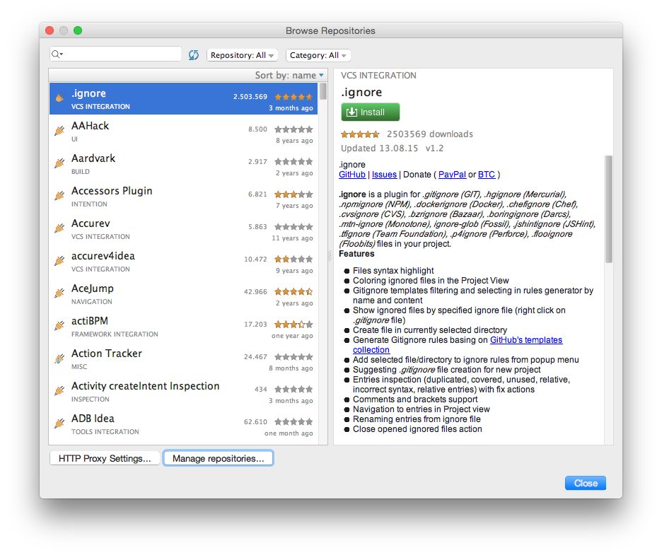
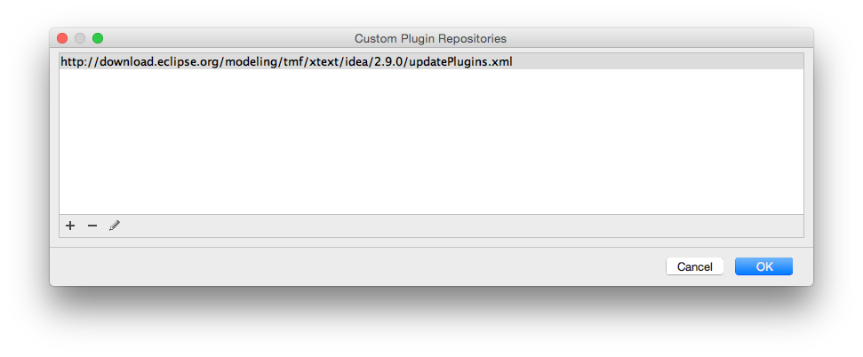
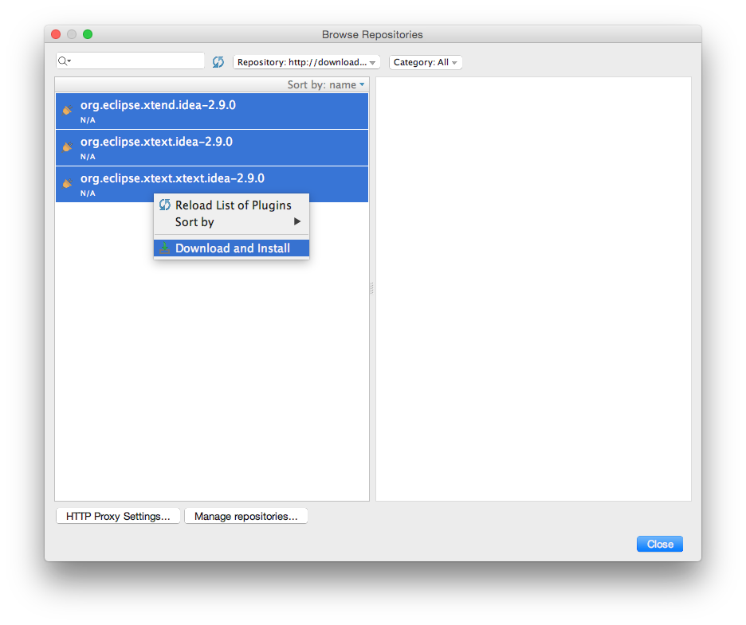
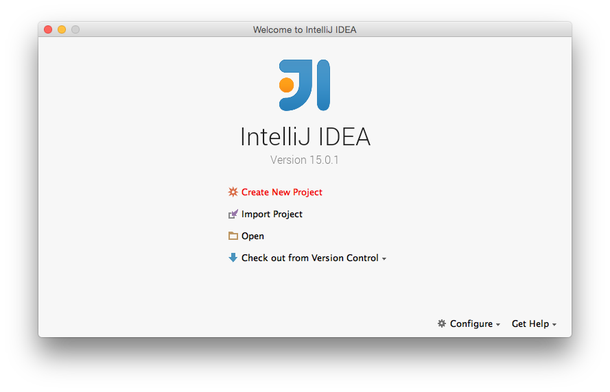
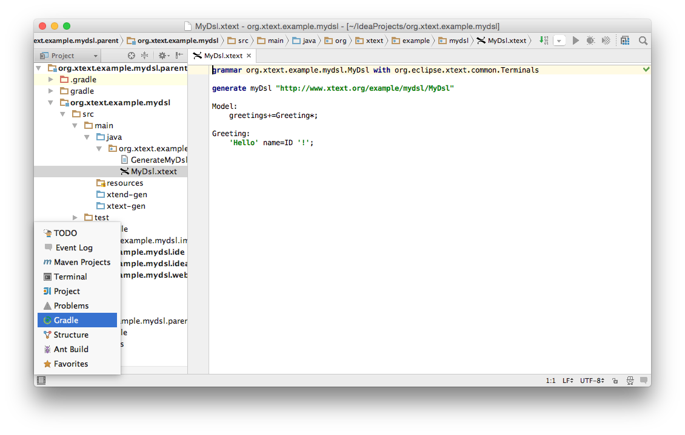
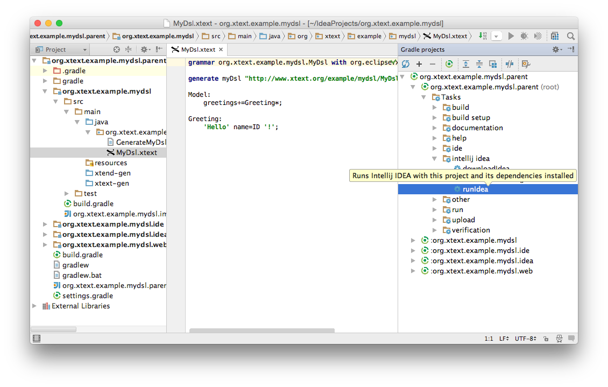
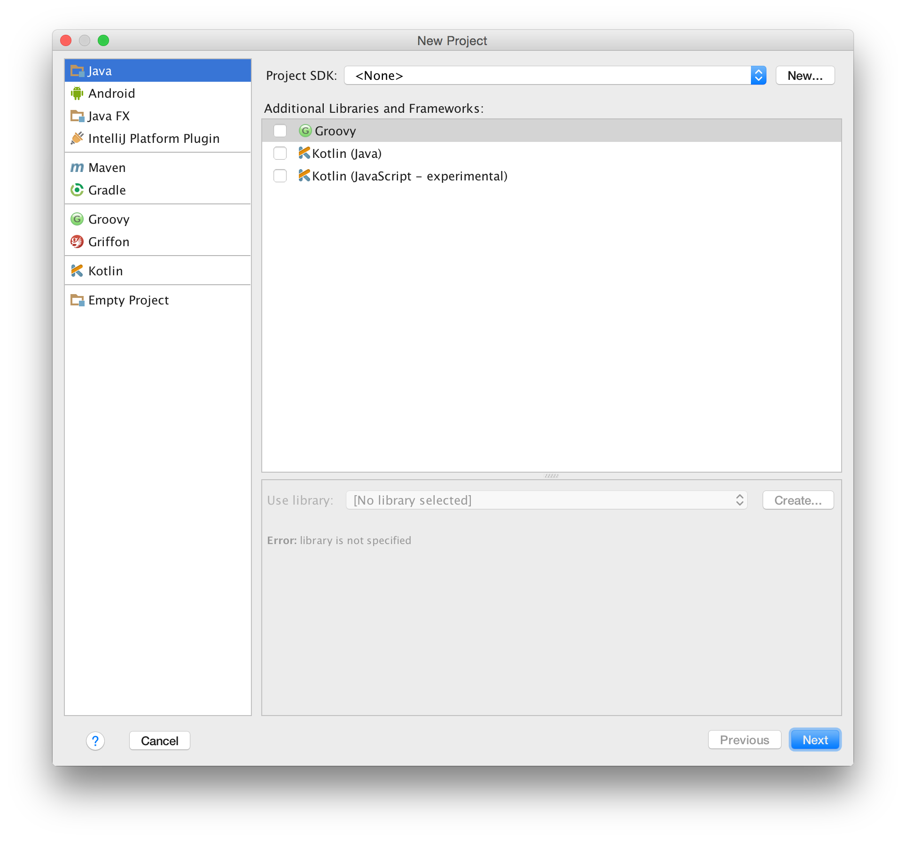
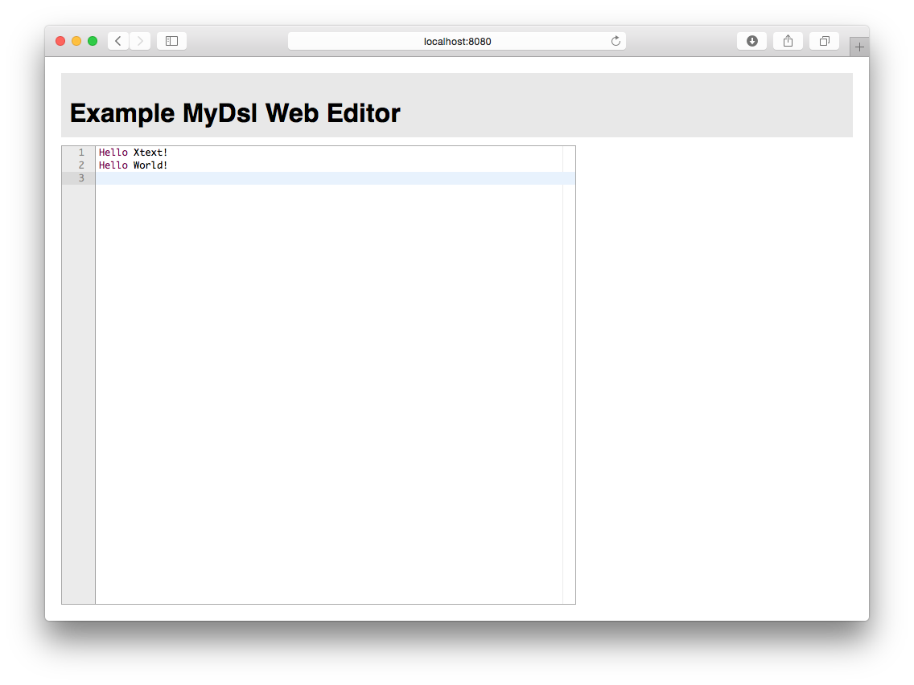

# {{page.title}} {#first-five-minutes}

In this chapter you will learn how to create a new Xtext project in IDEA, generate a fully working language infrastructure, and how to start editors tailored to your language for testing. We show you how this works for editors based on IntelliJ IDEA and web browsers.

But before we get started, download [IDEA](https://www.jetbrains.com/idea/), and install Xtext from one of our [update sites](../download.html). If you need no further assistance on that you may skip the following part and continue with [creating a new Xtext project](#new-project).

## Installing Xtext

Start IDEA and open the *Plugins* dialog via the *Configure* menu.


Hit *Browse repositories... &rarr; Manage repositories...* 



... and enter the [update sites](../download.html) of your choice. 


Select the Xtext update site, ...


... select all the offered plugins, and hit *Download and Install*.


Once the installation is done restart IDEA, e.g. by selecting on of the plugins and hitting *Restart IntelliJ IDEA*.


## Creating A New Xtext Project {#new-project}

Start the Xtext project wizard by selecting *Create New Project*


Select *Xtext* in the list on the left. Choose you favorite Java SDK, check the *Web integration* and *Testing support* for this tutorial, keep remaining settings, and go the *next* page.  


Change the *Project Name* to *org.xtext.example.mydsl*, and *finish*.


Your first Xtext project is set up, now! Find the generated grammar stub within the sub project *org.xtext.example.mydsl &rarr; src &rarr; main &rarr; java &rarr; org.xtext.example.mydsl*, as shown in the screen shot.


## Try The IDEA Editor {#testing-idea-editor}

The generation of your DSL-specific parser and editor infrastructure can be easily invoked by means of our dedicated Gradle extensions. Hence, open the *Gradle projects* view, e.g. via the magic button in the button in the lower left corner of the IDE. Make sure to have an active Internet connection and access to the JCenter artifact repository, since required artifacts will be downloaded during the first run. Make also sure to have Gradle working in online mode, which can be set in *Preferences... &rarr; Build, Execution, Deployment &rarr; Build Tools &rarr; Gradle* by unchecking *Offline work*.


Expand the items named *org.xtext.example.mydsl.parent &rarr; Tasks &rarr; intellij idea* and hit *runIdea*.


Once the test IDE is loaded create a new project, e.g., a Java project. You may skip the determination of the SDK to be used and proceed to the prompt of the project name.


Let's call the project *Sample*.


Once your project is set up create a plain file named *Sample.mydsl* in the *src* folder, and your DSL editor is opened. Enter the example text below, check out the content assist (*CTRL/CMD + Space*) as well as the live validation offered by the editor.

```mydsl
Hello Xtext!
Hello World!
```


## Try The Web Editor {#testing-web-editor}

For testing the web editor a local web server needs to be started. That can be launched by means of the Gradle build system, too. Thus, open the *Gradle projects* view as shown above. Again, make sure to have an active Internet connection and access to the JCenter artifact repository, since required artifacts will be downloaded during the first run. Make also sure to have Gradle working in online mode, which can be set in *Preferences... &rarr; Build, Execution, Deployment &rarr; Build Tools &rarr; Gradle* by unchecking *Offline work*.


Expand the items named *org.xtext.example.mydsl.parent &rarr; Tasks &rarr; run* and hit *jettyRun*. A bunch of required components is downloaded first, and after successful compilation a Jetty web server is launched. It is accessible via the URL printed in the *Run tool* view.


Open that URL in your favorite browsers, click into the text field, and enter sample text

```mydsl
Hello Xtext!
Hello World!
```
Check out the content assist by hitting *Ctrl/Cmd + Space*.



To stop the web server hit the red stop button on left of the *Run tool* view of IDEA or go to IDEA's main menu *&rarr; Run &rarr; Stop*.

## Conclusion {#five-minutes-conclusion}

In your first five minutes with Xtext, you have learned how to create a valid set of projects for building editors for your DSLs with IntelliJ IDEA. You have run Xtext's code generation and compilation by means of the Gradle build system. That allows you to test the generated editors implementing your DSLs.

Next up you should go through the more comprehensive [Domain Model Example](102_domainmodelwalkthrough.html). It explains the different concepts of the Xtext grammar language and illustrates how to customize various aspects of the language. 

---

**[Next Chapter: 15 Minutes Tutorial](102_domainmodelwalkthrough.html)**