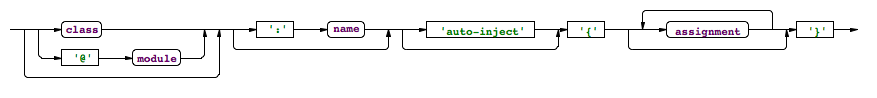

This chapiter may be updated, we have something new to say?
# {{page.title}} {#mwe2}

The Modeling Workflow Engine 2 (MWE2) is a rewritten backwards compatible implementation of the Modeling Workflow Engine (MWE). It is a declarative, externally configurable generator engine. Users can describe arbitrary object compositions by means of a simple, concise syntax that allows to declare object instances, attribute values and references. One use case - that's where the name had its origins - is the definition of workflows. Such a workflow consists usually of a number of components that interact with each other. There are components to read EMF resources, to perform operations (transformations) on them and to write them back or to generate any number of other artifacts out of the information. Workflows are typically executed in a single JVM. However there are no constraints the prevent implementors to provide components that spawn multiple threads or new processes.

## Examples {#mwe2-exampe}

Let's start with a couple of examples to demonstrate some usage scenarios for MWE2. The first example is a simple `HelloWorld` module that does nothing but print a message to standard out. The second module is assembled of three components that read an Ecore file, transform the contained classifier-names to upper-case and serialize the resource back to a new file. The last example uses the life-cycle methods of the [IWorkflowComponent]({{site.src.mwe}}/plugins/org.eclipse.emf.mwe2.runtime/src/org/eclipse/emf/mwe2/runtime/workflow/IWorkflowComponent.java) to print the execution time of the workflow.

### The Simplest Workflow {#mwe2-hello-world}

The arguably shortest MWE2 module may look like the following snippet:

```mwe2
module HelloWorld 

SayHello {
  message = "Hello World!"
}
```

It configures a very simple workflow component with a message that should be printed to `System.out` when the workflow is executed. The module begins with a declaration of its name. It must fulfill the Java conventions for fully qualified class-names. That's why the module `HelloWorld` has to be placed into the default package of a Java source folder. The second element in the module is the class-name `SayHello` which introduces the root element of the module. The interpreter will create an instance of the given type and configure it as declared between the curly braces. E.g. the assignment `message = "Hello World!"` in the module will be interpreted as an invocation of the `setMessage(String)` on the instantiated object. As one can easily imagine, the implementation of the class `SayHello` looks straight forward:

```java
import org.eclipse.emf.mwe2.runtime.workflow.IWorkflowComponent;
import org.eclipse.emf.mwe2.runtime.workflow.IWorkflowContext;

public class SayHello implements IWorkflowComponent {

  private String message = "Hello World!";
  public void setMessage(String message) {
    this.message = message;
  }
  public String getMessage() {
    return message;
  }

  public void invoke(IWorkflowContext ctx) {
    System.out.println(getMessage());
  }

  public void postInvoke() {}
  public void preInvoke() {}
}
```

It looks like a simple POJO and that's the philosophy behind MWE2. It is easily possible to assemble completely independent objects in a declarative manner. To make the workflow executable with the [Mwe2Runner]({{site.src.mwe}}/plugins/org.eclipse.emf.mwe2.launch/src/org/eclipse/emf/mwe2/launch/runtime/Mwe2Runner.java), the component `SayHello` must be nested in a root workflow:

```mwe2
module HelloWorld 

Workflow {
  component = SayHello {
    message = "Hello World!"
  }
}
```

The package `org.eclipse.emf.mwe2.runtime.workflow` of the class [Workflow]({{site.src.mwe}}/plugins/org.eclipse.emf.mwe2.runtime/src/org/eclipse/emf/mwe2/runtime/workflow/Workflow.java) is implicitly imported in MWE2 modules to make the the modules more concise. The execution result of this workflow will be revealed after a quick *Run As .. &rarr; MWE2 Workflow* in the console as 

`Hello World!`

### A Simple Transformation {#mwe2-simple-transformation}

The following workflow solves the exemplary task to rename every [EClassifier]({{site.src.emf}}/plugins/org.eclipse.emf.ecore/src/org/eclipse/emf/ecore/EClassifier.java) in an *\*.ecore* file. It consists of three components that read, modify and write the model file:

```mwe2
module Renamer
Workflow {
  component = ResourceReader {
        uri = "model.ecore"
  }
  component = RenamingTransformer {}
  component = ResourceWriter {
        uri = "uppercaseModel.ecore"
  }
}
```

The implementation of these components is surprisingly simple. It is easily possible to create own components even for minor operations to automate a process.

The `ResourceReader` simply reads the file with the given [URI]({{site.src.emf}}/plugins/org.eclipse.emf.common/src/org/eclipse/emf/common/util/URI.java) and stores it in a so called *slot* of the workflow context. A slot can be understood as a dictionary or map-entry.

```java
public class ResourceReader extends WorkflowComponentWithSlot {
  private String uri;
  public void invoke(IWorkflowContext ctx) {
    ResourceSet resourceSet = new ResourceSetImpl();
    URI fileURI = URI.createFileURI(uri); 
    Resource resource = resourceSet.getResource(fileURI, true);
    ctx.put(getSlot(), resource);
  }
  
  public void setUri(String uri) {
    this.uri = uri;
  }
  public String getUri() {
    return uri;
  }
}
```

The actual transformer takes the model from the slot and modifies it. It simply iterates the content of the resource, identifies each [EClassifier]({{site.src.emf}}/plugins/org.eclipse.emf.ecore/src/org/eclipse/emf/ecore/EClassifier.java) and sets its name. 

```java
public class RenamingTransformer extends WorkflowComponentWithSlot {
  private boolean toLowerCase = false;
  public void invoke(IWorkflowContext ctx) {
    Resource resource = (Resource) ctx.get(getSlot());
    EcoreUtil.resolveAll(resource);
    Iterator<Object> contents = EcoreUtil.getAllContents(resource, true);
    Iterator<EClassifier> iter = 
        Iterators.filter(contents, EClassifier.class);
    while(iter.hasNext()) {
      EClassifier classifier = (EClassifier) iter.next();
      classifier.setName(isToLowerCase() 
          ? classifier.getName().toLowerCase()
          : classifier.getName().toUpperCase());
    }
  }

  public void setToLowerCase(boolean toLowerCase) {
    this.toLowerCase = toLowerCase;
  }
  public boolean isToLowerCase() {
    return toLowerCase;
  }
}
```

After the model has been modified it should be written to a new file. That's what the `ResourceWriter` does. It actually takes the resource from the given *slot* and saves it with the configured [URI]({{site.src.emf}}/plugins/org.eclipse.emf.common/src/org/eclipse/emf/common/util/URI.java):

```java
public class ResourceWriter extends WorkflowComponentWithSlot {
  private String uri;
  public void invoke(IWorkflowContext ctx) {
    Resource resource = (Resource) ctx.get(getSlot());
    URI uri = URI.createFileURI(getUri());
    uri = resource.getResourceSet().getURIConverter().normalize(uri);
    resource.setURI(uri);
    try {
      resource.save(null);
    } catch (IOException e) {
      throw new WrappedException(e);
    }
  }

  public void setUri(String uri) {
    this.uri = uri;
  }
  public String getUri() {
    return uri;
  }
}
```

Last but not least, the common super type for those components looks like this:

```java
public abstract class WorkflowComponentWithSlot 
      implements IWorkflowComponent {
  private String slot = "model";
  public void setSlot(String slot) {
    this.slot = slot;
  }
  public String getSlot() {
    return slot;
  }
  
  public void postInvoke() {}
  public void preInvoke() {}
}
```

Each of the mentioned implementations is rather simple and can be done in a couple of minutes. Many tedious tasks that developers face in their daily work can be addressed by a chain of rather simple components. MWE2 can be used to automate these tasks with minimum effort.

### A Stop-Watch {#mwe2-stopwatch}

The last example demonstrates how to combine the MWE2 concepts to create a simple stop-watch that allows to measure the execution time of a set of components. The idea is to add the very same stop-watch twice as a component to a workflow. It will measure the time from the first pre-invoke to the last post-invoke event and print the elapsed milliseconds to the console.

```java
public class StopWatch implements IWorkflowComponent {
  private long start;
  private boolean shouldStop = false;
  public void invoke(IWorkflowContext ctx) {}

  public void postInvoke() {
    if (shouldStop) {
      long elapsed = System.currentTimeMillis() - start;
      System.out.println("Time elapsed: " + elapsed + " ms");
    }
    shouldStop = true;
  }

  public void preInvoke() {
    start = System.currentTimeMillis();
  }
}
```

Clients who want to leverage this kind of stop-watch may use the following pattern. The instance of the class `StopWatch` has to be added as the first component and the last component to a workflow. Every component in-between will be measured. In this case, it is another workflow that does not need know about this decoration. The idea is to use a local identifier for the instantiated `StopWatch` and reuse this one at the end to receive the post-invoke life-cycle event twice. 

```mwe2
module MeasuredWorkflow

Workflow {
  component = StopWatch: stopWatch {}
  component = @OtherWorkflow {}
  component = stopWatch
}
```

## Language Reference {#mwe2-language-reference}

MWE2 has a few well defined concepts which can be combined to assemble arbitrary object graphs in a compact and declarative manner.

*   A MWE2 file defines a `module` which exposes its root `component` as reusable artifact.
*   `Properties` can be used to extract reusable, configurable parts of the workflow.
*   Components are mapped to plain vanilla *Java objects*. Arbitrary `setABC(..)` and `addXYZ(..)` methods are used to configure them.

Let's consider the follow short example module and `SampleClass` to explain these concepts.

```mwe2
module com.mycompany.Example

import java.util.*

SampleClass {
  singleValue = 'a string'
  multiValue = ArrayList {}
  child = {}
} 
```

```java
package com.mycompany;

import java.util.List;

public class SampleClass {
  public void setSingleValue(String value) {..}
  public void addMultiValue(List<?> value) {..}
  public void addChild(SampleClass value) {..}
}
```

### Mapping to Java Classes {#mwe2-java-references}

The module `com.mycompany.Example` defines a root component of type `com.mycompany.SampleClass`. It is possible to use the simple class-name because MWE2 uses the very same visibility rules as the Java compiler. Classes that are in the same package as the module can be referenced by their simple name. The same rule applies for classes from the `java.lang` package. For convenience reasons is the package `org.eclipse.emf.mwe2.runtime.workflow` implicitly imported as well as it exposes some library workflow components. However, the imports are more flexible then in Java since MWE2-imports can be relative, e.g. the `import java.*` resolves the reference `util.ArrayList` to `java.util.ArrayList`. 

The root instance of type `SampleClass` has to be configured after it has been created. Therefore the method `setSingleValue` will be called at first. The given parameter is `'a string'`. The method is identified by its name which starts with `set`. To allow to assign multi-value properties, MWE provides access to methods called `add*` as well. 

If the right side of the assignment in the workflow file does not define a class explicitly, its type is inferred from the method parameter. The line `child = {}` is equivalent to `child = SampleClass {}` and creates a new instance of `SampleClass`.

MWE2 ships with nice tool support. The editor will provide content assist for the allowed types and highlight incompatible assignments. The available properties for Java classes will be proposed as well.

### Module {#mwe2-module}

As MWE2 modules have a fully qualified name, it is possible to refer to them from other modules. The type of the module is derived from the type of its root component. The `com.mycompany.Example` can be assigned at any place where a `com.mycompany.SampleClass` is expected.

Let's create a second module `com.mycompany.Second` like this:

```mwe2
module com.mycompany.sub.Second

import com.mycompany.*

SampleClass {
  child = @Example {}
} 
```

The `child` value will be assigned to an instance of `SampleClass` that is configured as in the first example workflow. This enables nice composition and a very focused, reusable component design. 

As the same rules apply in MWE2 like in Java, the module `com.mycompany.sub.Second` has to be defined in a file called *Second.mwe2* in the package `com.mycompany.sub`. The import semantic for other modules is the same as for classes. The import statement allows to refer to `com.mycompany.Example` with a shortened name.

### Properties {#mwe2-properties}

MWE2 allows to extract arbitrary information into properties to ensure that these pieces are not cluttered around the workflow and to allow for easier external customization. The exemplary component definition was only changed slightly by introducing a property `value`.

```mwe2
module com.mycompany.Example

var value = 'a string'

SampleClass {
  singleValue = value
}
```

The type of the property will be derived from the default value similar to the mechanism that is already known from `set`- and `add`-methods. If no default value is given, [String]({{site.javadoc.java}}/java/lang/String.html) will be assumed. However, properties are not limited to strings. The second built in type is boolean via the familiar literals `true` and `false`. More flexibility is available via actual component literals.

```mwe2
module com.mycompany.Example

var childInstance = SampleClass {
                      singleValue = "child"
                    }

SampleClass {
  child = childInstance
}
```

If one wants to define string properties that are actual reusable parts for other properties, she may use defined variables inside other literals like this: 

```mwe2
var aString = "part"
var anotherString = "reuse the ${part} here"
```

This is especially useful for file paths in workflows as one would usually want to define some common root directories only once in the workflow and reuse this fragment across certain other file locations.

### Mandatory Properties {#mwe2-mandatory}

It is not always feasible to define default values for properties. That is where mandatory properties come into play. Modules define their interface not only via their fully qualified name and the type of the root component but also by means of the defined properties. 

```mwe2
module com.mycompany.Example

var optional = 'a string'
var mandatory

SampleClass {
  singleValue = optional
  child = {
    singleValue = mandatory
  }
}
```

This version of the example module exposes two externally assignable properties. The second one has no default value assigned and is thereby considered to be mandatory. The mandatory value must be assigned if we reuse `org.mycompany.Example` in another module like this:

```mwe2
module com.mycompany.Second

var newMandatory

@Example {
  mandatory = "mandatoryValue"
  optional = newMandatory
} 
```

Note that it is even possible to reuse another module as the root component of a new module. In this case we set the mandatory property of `Example` to a specific constant value while the previously optional value is now redefined as mandatory by means of a new property without a default value.

It is not only possible to define mandatory properties for MWE2 modules but for classes as well. Therefore MWE2 ships with the [Mandatory]({{site.src.mwe}}/plugins/org.eclipse.emf.mwe2.runtime/src/org/eclipse/emf/mwe2/runtime/Mandatory.java) annotation. If a `set`- or `add`-method is marked as [Mandatory]({{site.src.mwe}}/plugins/org.eclipse.emf.mwe2.runtime/src/org/eclipse/emf/mwe2/runtime/Mandatory.java), the module validation will fail if no value was assigned to that feature.

### Named Components {#mwe2-named-components}

Properties are not the only way to define something that can be reused. It is possible to assign a name to any instantiated component whether it's created from a class literal or from another component. This allows to refer to previously created and configured instances. Named instances can come handy for notification and call-back mechanisms or more general in terms of defined life-cycle events. 

If we wanted to assign the created instance to a property of itself, we could use the following syntax:

```mwe2
module com.mycompany.Example

SampleClass : self {
  child = self
}
```

A named component can be referenced immediately after its creation but it is not possible to use forward references in a MWE2 file.

### Auto Injection {#mwe2-auto-inject}

Existing modules or classes often expose a set of properties that will be assigned to features of its root component or set- and add- methods respectively. In many cases its quite hard to come up with yet another name for the very same concept which leads to the situation where the properties itself have the very same name as the component's feature. To avoid the overall repetition of assignments, MWE2 offers the possibility to use the `auto-inject` modifier on the component literal:

```mwe2
module com.mycompany.Example

var child = SampleClass {}

SampleClass auto-inject {
}
```

This example will implicitly assign the value of the property `child` to the feature `child` of the root component. This is especially useful for highly configurable workflows that expose dozens of optional parameters each of which can be assigned to one or more components.

The `auto-inject` modifier can be used for a subset of the available features as well. It will suppressed for the explicitly set values of a component. 

## Syntax Reference {#mwe2-syntax-reference}

The following chapter serves as a reference for the concrete syntax of MWE2. The building blocks of a module will be described in a few words.

MWE2 is not sensitive to white space and allows to define line-comments and block comments everywhere. The syntax is the same as one is used to from the Java language:

```mwe2
// This is a comment
/* 
  This is another one.
*/
```

Every name in MWE2 can be a fully qualified identifier and must follow the Java conventions. However, in contrast to Java identifiers it is not allowed to use German umlauts or Unicode escape sequences in identifiers. A valid ID-segment in MWE2 starts with a letter or an underscore and is followed by any number of letters, numbers or underscores. An identifier is composed from one or more segments which are delimited by a '.' dot.

```xtext
Name: ID ('.' ID)*;
ID: ('a'..'z'|'A'..'Z'|'_') ('a'..'z'|'A'..'Z'|'_'|'0'..'9')*; 
```

MWE2 does not use a semicolon as a statement delimiter at any place.

### Module {#mwe2-module-syntax}


A `module` consists of four parts. The very first statement in a *\*.mwe2* file is the module declaration. The name of the module must follow the naming convention for Java classes. That MWE2 file's name must therefore be the same as the last segment of the module-name and it has to be placed in the appropriate package of a Java source path.

It is allowed to define any number of import statements in a module. Imports are either suffixed by a wildcard or they import a concrete class or module. MWE2 can handle relative imports in case one uses the wildcard notation:

```xtext
'import' name '.*'?   
```

### Property {#mwe2-property-syntax}

The list of declared properties follows the optional import section. It is allowed to define modules without any properties. 


Each declared property is locally visible in the module. It furthermore defines an assignable feature of the module in case one refers to it from another module. Properties may either have a default value or they are considered to be *mandatory*. If the type of property is omitted it will be inferred from the default value. The default type of a property is [String]({{site.javadoc.java}}/java/lang/String.html). That is, if no default value is available, the property is *mandatory* and of type [String]({{site.javadoc.java}}/java/lang/String.html).

There are four types of values available in MWE2. One may either define a string, boolean or component literal or a reference to a previously defined property. 

### Component {#mwe2-component-syntax}

The building block of a module is the root component. It defines the externally visible type of the module and may either be created from a Java type or from another module.



The type of the component can be derived in many cases except for the root component. That's why it's optional in the component literal. If no type is given, it will be inferred from the left side of the assignment. The assigned feature can either be a declared property of the module or a `set`- or `add`-method of a Java class.

Components can be named to make them referable in subsequent assignments. Following the `':'` keyword, one can define an identifier for the instantiated component. The identifier is locally visible in the module and any assignment that is defined after the named component can refer to this identifier and thereby exactly point to the instantiated object.

The next option for a component is `auto-inject`. If this modifier is set on a component, any available feature of the component that has the same name as a property or previously created named component will be automatically assigned.

The core of a component is the list of assignments between the curly braces. An arbitrary number of values can be set on the component by means of feature-to-value pairs. 


The available constructs on the right hand side of the assignment are the same as for default values for properties. 

### String Literals {#mwe2-string-literals-syntax}

String values are likely to be the most used literals in MWE2. There is a convenient syntax for string concatenation available due to the high relevance in a descriptive object composition and configuration language. MWE2 strings are multi-line strings and can be composed of several parts.

```mwe2
var aString = 'a value'
var anotherString = 'It is possible to embed ${aString} into
 a multi-line string'
```

This is especially convenient for path-substitution if one defines e.g. a common root directory and wants to specify other paths relative to the base. 

There are two different delimiters available for strings. Users are free to either use single- or double-quotes to start and end strings. If a certain string contains a lot of single-quotes one would better choose double-quotes as delimiter and vice versa. There is no semantic difference between both notations.

The escape character in MWE2 is the back-slash `"\\"`. It can be used to write line-breaks or tabular characters explicitly and to escape the beginning of substitution variables `${` and the quotes itself. Allowed escape sequences are:

|:---|:---|:---|
|`\n` |line break|
|`\r` |carriage return|
|`\t` |tabular character|
|`\'` |single-quote (can be omitted in double-quoted strings)|
|`\"` |double-quote (can be omitted in single-quoted strings)|
|`\${`|escape the substitution variable start ${|
|`\\` |the back-slash itself|

Other escape sequence are illegal in MWE2 strings.

### Boolean Literals {#mwe2-boolean-literals}

MWE2 has native support for the boolean type. The literals are `true` and `false`.

### References {#mwe2-references}

Each assigned value in MWE2 either as default for properties or in a component assignment can be a reference to a previously declared property or named component. The can be referenced intuitively by their name.

---

**[Next Chapter: Typical Language Configurations](307_special_languages.html)**
