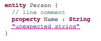

# {{page.title}} {#ide-concepts}

For the following part we will refer to the [state machine example]({{site.src.xtext}}/examples/org.eclipse.xtext.xtext.ui.examples/contents/org.eclipse.xtext.example.fowlerdsl/src/org/eclipse/xtext/example/fowlerdsl/Statemachine.xtext) to describe the different aspects of Xtext's UI features.

## Label Provider {#label-provider}

There are various places in the UI in which model elements have to be presented to the user: In the [outline view](#outline), in [hyperlinks](#hyperlinking), in [content proposals](#content-assist), find dialogs etc. Xtext allows to customize each of these appearances by individual implementation of the [ILabelProvider]({{site.javadoc.eclipse-platform}}/org/eclipse/jface/viewers/ILabelProvider.html) interface. 

An [ILabelProvider]({{site.javadoc.eclipse-platform}}/org/eclipse/jface/viewers/ILabelProvider.html) has two methods: `getText(Object)` returns the text in an object's label, while `getImage(Object)` returns the icon. In addition, the Eclipse UI framework offers the [IStyledLabelProvider]({{site.javadoc.eclipse-platform}}/org/eclipse/jface/viewers/DelegatingStyledCellLabelProvider.IStyledLabelProvider.html), which returns a [StyledString]({{site.javadoc.eclipse-platform}}/org/eclipse/jface/viewers/StyledString.html) (i.e. with custom fonts, colors etc.) in the `getStyledText(Object)` method.

Almost all label providers in the Xtext framework inherit from the base class [AbstractLabelProvider]({{site.src.xtext}}/plugins/org.eclipse.xtext.ui/src/org/eclipse/xtext/ui/label/AbstractLabelProvider.java) which unifies both approaches. Subclasses can either return a styled string or a string in the `doGetText(Object)` method. The framework will automatically convert it to a styled text (with default styles) or to a plain text in the respective methods. 

Dealing with images can be cumbersome, too, as image handles tend to be scarce system resources. The [AbstractLabelProvider]({{site.src.xtext}}/plugins/org.eclipse.xtext.ui/src/org/eclipse/xtext/ui/label/AbstractLabelProvider.java) helps you managing the images: In your implementation of `doGetImage(Object)` you can as well return an [Image]({{site.javadoc.eclipse-platform}}/org/eclipse/swt/graphics/Image.html), an [ImageDescriptor]({{site.javadoc.eclipse-platform}}/org/eclipse/jface/resource/ImageDescriptor.html) or a string, representing a path in the *icons/* folder of the containing plug-in. This path is actually configurable by Google Guice. Have a look at the [PluginImageHelper]({{site.src.xtext}}/plugins/org.eclipse.xtext.ui/src/org/eclipse/xtext/ui/PluginImageHelper.java) to learn about the customizing possibilities.

If you have the [LabelProviderFragment]({{site.src.xtext}}/plugins/org.eclipse.xtext.generator/src/org/eclipse/xtext/ui/generator/labeling/LabelProviderFragment.java) in the list of generator fragments in the MWE2 workflow for your language, it will automatically create stubs and bindings for an [`{MyLang}EObjectLabelProvider`](#eobject-label-provider) and an [`{MyLang}DescriptionLabelProvider`](#description-label-provider) which you can implement manually. 

### Label Providers For EObjects {#eobject-label-provider}

The EObject label provider refers to actually loaded and thereby available model elements. By default, Xtext binds the [DefaultEObjectLabelProvider]({{site.src.xtext}}/plugins/org.eclipse.xtext.ui/src/org/eclipse/xtext/ui/label/DefaultEObjectLabelProvider.java) to all use cases, but you can change the binding individually for the Outline, Content Assist or other places. For that purpose, there is a so called *binding annotation* for each use case. For example, to use a custom *MyContentAssistLabelProvider* to display elements in the content assist, you have to override `configureContentProposalLabelProvider(..)` in your language's UI module:

```java
@Override
public void configureContentProposalLabelProvider(Binder binder) {
  binder.bind(ILabelProvider.class)
    .annotatedWith(ContentProposalLabelProvider.class)
    .to(MyContentAssistLabelProvider.class);
}
```

If your grammar uses an imported [EPackage]({{site.src.emf}}/plugins/org.eclipse.emf.ecore/src/org/eclipse/emf/ecore/EPackage.java), there may be an existing *edit*-plug-in generated by EMF that also provides label providers for model elements. To use this as a fallback, your label provider should call the constructor with the delegate parameter and use dependency injection for its initialization, e.g.

```java
public class MyLabelProvider {
  @Inject  
  public MyLabelProvider(AdapterFactoryLabelProvider delegate) {
    super(delegate);
  }
}
```

#### DefaultEObjectLabelProvider {#default-eobject-label-provider}

The default implementation of the [ILabelProvider]({{site.javadoc.eclipse-platform}}/org/eclipse/jface/viewers/ILabelProvider.html) interface utilizes the polymorphic dispatcher idiom to implement an external visitor as the requirements of the label provider are kind of a best match for this pattern. It boils down to the fact that the only thing you need to do is to implement a method that matches a specific signature. It either provides a image filename or the text to be used to represent your model element. Have a look at following example to get a more detailed idea about the [DefaultEObjectLabelProvider]({{site.src.xtext}}/plugins/org.eclipse.xtext.ui/src/org/eclipse/xtext/ui/label/DefaultEObjectLabelProvider.java).

```java
public class SecretCompartmentsLabelProvider 
    extends DefaultLabelProvider {

  public String text(Event event) {
    return event.getName() + " (" + event.getCode() + ")";
  }
  
  public String image(Event event) {
    return "event.gif";
  }
  
  public String image(State state) {
    return "state.gif";
  }
}
```

What is especially nice about the default implementation is the actual reason for its class name: It provides very reasonable defaults. To compute the label for a certain model element, it will at first have a look for an [EAttribute]({{site.src.emf}}/plugins/org.eclipse.emf.ecore/src/org/eclipse/emf/ecore/EAttribute.java) *name* and try to use this one. If it cannot find such a feature, it will try to use the first feature that can be used best as a label. At worst it will return the class name of the model element, which is kind of unlikely to happen.

You can a also customize error handling by overriding the methods `handleTextError()` or `handleImageError()`.

### Label Providers For Index Entries {#description-label-provider}

Xtext maintains an index of all model elements to allow quick searching and linking without loading the referenced resource (see the chapter on [index-based scopes](303_runtime_concepts.html#index-based) for details). The elements from this index also appear in some UI contexts, e.g. in the *Find model elements* dialog or in the *Find references* view. For reasons of scalability, the UI should not automatically load resources, so we need another implementation of a label provider that works with the elements from the index, i.e. [IResourceDescription]({{site.src.xtext}}/plugins/org.eclipse.xtext/src/org/eclipse/xtext/resource/IResourceDescription.java), [IEObjectDescription]({{site.src.xtext}}/plugins/org.eclipse.xtext/src/org/eclipse/xtext/resource/IEObjectDescription.java), and [IReferenceDescription]({{site.src.xtext}}/plugins/org.eclipse.xtext/src/org/eclipse/xtext/resource/IReferenceDescription.java).

The default implementation of this service is the [DefaultDescriptionLabelProvider]({{site.src.xtext}}/plugins/org.eclipse.xtext.ui/src/org/eclipse/xtext/ui/label/DefaultDescriptionLabelProvider.java). It employs the same polymorphic dispatch mechanism as the [DefaultEObjectLabelProvider](#default-eobject-label-provider). The default text of an [IEObjectDescription]({{site.src.xtext}}/plugins/org.eclipse.xtext/src/org/eclipse/xtext/resource/IEObjectDescription.java) is its indexed name. The image is resolved by dispatching to `image(EClass)` with the [EClass]({{site.src.emf}}/plugins/org.eclipse.emf.ecore/src/org/eclipse/emf/ecore/EClass.java) of the described object. This is likely the only method you want to override. Instances of [IResourceDescription]({{site.src.xtext}}/plugins/org.eclipse.xtext/src/org/eclipse/xtext/resource/IResourceDescription.java) will be represented with their path and the icon registered for your language's editor. 

To have a custom description label provider, make sure it is bound in your UI module:

```java
public void configureResourceUIServiceLabelProvider(Binder binder) {
  binder.bind(ILabelProvider.class)
    .annotatedWith(ResourceServiceDescriptionLabelProvider.class)
    .to(MyCustomDefaultDescriptionLabelProvider.class);
}
```

## Content Assist {#content-assist}

The Xtext generator, amongst other things, generates the following two content assist related artifacts:

*   An abstract proposal provider class named `Abstract{MyLang}ProposalProvider` generated into the *src-gen* folder within the *ui* project, and
*   a concrete subclass in the *src*-folder of the *ui* project called `{MyLang}ProposalProvider`

First we will investigate the generated `Abstract{MyLang}ProposalProvider` with methods that look like this:

```java
public void complete{TypeName}_{FeatureName}(
  EObject model, Assignment assignment, 
  ContentAssistContext context, ICompletionProposalAcceptor acceptor) {
  // clients may override
}

public void complete_{RuleName}(
  EObject model, RuleCall ruleCall, 
  ContentAssistContext context, ICompletionProposalAcceptor acceptor) {
  // clients may override
}
```

The snippet above indicates that the generated class contains a *complete\**-method for each assigned feature in the grammar and for each rule. The braces in the snippet are place-holders that should give a clue about the naming scheme used to create the various entry points for implementors. The generated proposal provider falls back to some default behavior for cross-references and keywords. Furthermore it inherits the logic that was introduced in grammars that were mixed into the current language. 

Clients who want to customize the behavior may override the methods from the [AbstractJavaBasedContentProposalProvider]({{site.src.xtext}}/plugins/org.eclipse.xtext.ui/src/org/eclipse/xtext/ui/editor/contentassist/AbstractJavaBasedContentProposalProvider.java) or introduce new methods with a specialized first parameter. The framework inspects the type of the model object and dispatches method calls to the most concrete implementation that can be found.

It is important to know that, for a given offset in a model file, many possible grammar elements exist. The framework dispatches to the method declarations for any valid element. This means that a bunch of *complete\** methods may be called.

To provide a dummy proposal for the code of an `event` instance, you may introduce a specialization of the generated method and implement it as follows. This will propose `ZonkID` for an event with the name `Zonk`.

```java
public void completeEvent_Code(
  Event event, Assignment assignment, 
  ContentAssistContext context, ICompletionProposalAcceptor acceptor) {
  // call implementation of superclass
  super.completeEvent_Code(model, assignment, context, acceptor);

  // compute the plain proposal
  String proposal = event.getName() + "ID";

  // Create and register the completion proposal:
  // The proposal may be null as the createCompletionProposal(..) 
  // methods check for valid prefixes and terminal token conflicts.
  // The acceptor handles null-values gracefully.
  acceptor.accept(createCompletionProposal(proposal, context));
}
```

## Quick Fixes {#quick-fixes}

For validations written using the [AbstractDeclarativeValidator](303_runtime_concepts.html#custom-validation) it is possible to provide corresponding quick fixes in the editor. To be able to implement a quick fix for a given diagnostic (a warning or error) the underlying *cause* of the diagnostic must be known (i.e. what actual problem does the diagnostic represent), otherwise the fix doesn't know what needs to be done. As we don't want to deduce this from the diagnostic's error message we associate a problem specific *code* with the diagnostic.

In the following example taken from the *DomainmodelJavaValidator* the diagnostic's *code* is given by the third argument to the `warning()` method and it is a reference to the static [String]({{site.javadoc.java}}/java/lang/String.html) field `INVALID_TYPE_NAME` in the validator class.

```java
warning("Name should start with a capital", 
    DomainmodelPackage.TYPE__NAME, INVALID_TYPE_NAME, type.getName());
```

Now that the validation has a unique code identifying the problem we can register quick fixes for it. We start by adding the [QuickfixProviderFragment]({{site.src.xtext}}/plugins/org.eclipse.xtext.generator/src/org/eclipse/xtext/ui/generator/quickfix/QuickfixProviderFragment.java) to our workflow and after regenerating the code we should find an empty class *MyDslQuickfixProvider* in our DSL's UI project and new entries in the *plugin.xml\_gen* file.

Continuing with the `INVALID_TYPE_NAME` problem from the domain model example we add a method with which the problem can be fixed (have a look at the *DomainmodelQuickfixProvider* for details):

```java
@Fix(DomainmodelJavaValidator.INVALID_TYPE_NAME)
public void fixName(final Issue issue, 
  IssueResolutionAcceptor acceptor) {
  acceptor.accept(issue, 
    "Capitalize name", // quick fix label
    "Capitalize name  of '" + issue.getData()[0] + "'", 
                       // description
    "upcase.png",      // quick fix icon
    new IModification() {
      public void apply(IModificationContext context) 
    throws BadLocationException {
        IXtextDocument xtextDocument = context.getXtextDocument();
        String firstLetter = xtextDocument.get(issue.getOffset(), 1);
        xtextDocument.replace(issue.getOffset(), 1, 
                              Strings.toFirstUpper(firstLetter));
      }
    }
  );
}
```

By using the correct signature (see below) and annotating the method with the @[Fix]({{site.src.xtext}}/plugins/org.eclipse.xtext.ui/src/org/eclipse/xtext/ui/editor/quickfix/Fix.java) annotation referencing the previously specified issue code from the validator, Xtext knows that this method implements a fix for the problem. This also allows us to annotate multiple methods as fixes for the same problem.

The first three parameters given to the [IssueResolutionAcceptor]({{site.src.xtext}}/plugins/org.eclipse.xtext.ui/src/org/eclipse/xtext/ui/editor/quickfix/IssueResolutionAcceptor.java) define the UI representation of the quick fix. As the document is not necessarily loaded when the quick fix is offered, we need to provide any additional data from the model that we want to refer to in the UI when creating the issue in the validator above. In this case, we provided the existing type name. The additional data is available as [Issue.getData()]({{site.src.xtext}}/plugins/org.eclipse.xtext/src/org/eclipse/xtext/validation/Issue.java). As it is persisted in markers, only strings are allowed. 

The actual model modification is implemented in the [IModification]({{site.src.xtext}}/plugins/org.eclipse.xtext.ui/src/org/eclipse/xtext/ui/editor/model/edit/IModification.java). The [IModificationContext]({{site.src.xtext}}/plugins/org.eclipse.xtext.ui/src/org/eclipse/xtext/ui/editor/model/edit/IModificationContext.java) provides access to the erroneous document. In this case, we're using Eclipse's [IDocument]({{site.javadoc.eclipse-platform}}/org/eclipse/jface/text/IDocument.html) API to replace a text region. 

If you prefer to implement the quick fix in terms of the semantic model use a [ISemanticModification]({{site.src.xtext}}/plugins/org.eclipse.xtext.ui/src/org/eclipse/xtext/ui/editor/model/edit/ISemanticModification.java) instead. Its `apply(EObject, IModificationContext)` method will be invoked inside a modify-transaction and the first argument will be the erroneous semantic element. This makes it very easy for the fix method to modify the model as necessary. After the method returns the model as well as the Xtext editor's content will be updated accordingly. If the method fails (throws an exception) the change will not be committed. The following snippet shows a semantic quick fix for a similar problem.

```java
@Fix(DomainmodelJavaValidator.INVALID_FEATURE_NAME)
public void fixFeatureName(final Issue issue, 
                           IssueResolutionAcceptor acceptor) {
  acceptor.accept(issue, 
    "Uncapitalize name",    // label
    "Uncapitalize name of '" + issue.getData()[0] + "'", // description
    "upcase.png",           // icon 
    new ISemanticModification() {
      public void apply(EObject element, IModificationContext context) {
        ((Feature) element).setName(
            Strings.toFirstLower(issue.getData()[0]));
      }
    }
  );
}
```

### Quick Fixes for Linking Errors and Syntax Errors

You can even define quick fixes for linking errors. The issue codes are assigned by the [ILinkingDiagnosticMessageProvider]({{site.src.xtext}}/plugins/org.eclipse.xtext/src/org/eclipse/xtext/linking/ILinkingDiagnosticMessageProvider.java). Have a look at the domain model example how to add quick fixes for these errors.

Hence, there is the [ISyntaxErrorMessageProvider]({{site.src.xtext}}/plugins/org.eclipse.xtext/src/org/eclipse/xtext/parser/antlr/ISyntaxErrorMessageProvider.java) to assign issue codes to syntactical errors.

## Template Proposals {#templates}

Xtext-based editors automatically support code templates. That means that you get the corresponding preference page where users can add and change template proposals. If you want to ship a couple of default templates, you have to put a file named *templates.xml* inside the *templates* directory of the generated UI-plug-in. This file contains templates in a format as described in the [Eclipse online help](http://help.eclipse.org/luna/topic/org.eclipse.cdt.doc.user/tasks/cdt_t_imp_code_temp.htm) .


By default Xtext registers *context types* that follow certain patterns. A context type will be created 

1.  for each rule (`{languageName}.{RuleName}`) and
1.  for each keyword (`{languageName}.kw_{keyword}`).

If you don't like these defaults you'll have to subclass [XtextTemplateContextTypeRegistry]({{site.src.xtext}}/plugins/org.eclipse.xtext.ui/src/org/eclipse/xtext/ui/editor/templates/XtextTemplateContextTypeRegistry.java) and configure it via [Guice](302_configuration.html#guicemodules). 

In addition to the standard template proposal extension mechanism, Xtext ships with a predefined set of [TemplateVariableResolvers]({{site.javadoc.eclipse-platform}}/org/eclipse/jface/text/templates/TemplateVariableResolver.html) to resolve special variable types in templates. Besides the standard template variables available in [GlobalTemplateVariables]({{site.javadoc.eclipse-platform}}/org/eclipse/jface/text/templates/GlobalTemplateVariables.html) like `${user}`, `${date}`, `${time}`, `${cursor}`, etc., these [TemplateVariableResolvers]({{site.javadoc.eclipse-platform}}/org/eclipse/jface/text/templates/TemplateVariableResolver.html) support the automatic resolving of cross references enumeration values. Both resolvers are explained in the following sections.

It is best practice to edit the templates in the preferences page, export them into the *templates.xml*-file and put this one into the *templates* folder of your UI-plug-in. However, these templates will not be visible by default. To fix it, you have to manually edit the xml-file and insert an `id` attribute for each template element. Note that the attribute name is case sensitive. As always in eclipse plug-in development, if the folder *templates* did not exist before, you have to add it to the *bin.includes* in your *build.properties*. 

### Cross Reference Template Variable Resolver

Xtext comes with a specific template variable resolver called [CrossReferenceTemplateVariableResolver]({{site.src.xtext}}/plugins/org.eclipse.xtext.ui/src/org/eclipse/xtext/ui/editor/templates/CrossReferenceTemplateVariableResolver.java), which can be used to pre-populate placeholders for cross-references within a template. The respective template variable is called *CrossReference* and its syntax is as follows:

`${<displayText>:CrossReference([<MyPackageName>.]<MyType>.<myRef>)}`

Where "displayText" is the initial value that is shown in the editor. It is also the identifier for a place holder so that multiple place holders with the same name will be updated at once by the user using linked editing.

This small example yields the text *event =\> state* and allows selecting any events and states using a drop down:

```xml
<template 
  name="transition" 
  description="event transition" 
  id="transition"
    context="org.xtext.example.SecretCompartments.Transition" 
    enabled="true">
${event:CrossReference('Transition.event')} =>
  ${state:CrossReference('Transition.state')
</template>
```


### Enumeration Template Variable Resolver

The [EnumTemplateVariableResolver]({{site.src.xtext}}/plugins/org.eclipse.xtext.ui/src/org/eclipse/xtext/ui/editor/templates/EnumTemplateVariableResolver.java) resolves a template variable to [EEnumLiterals]({{site.src.emf}}/plugins/org.eclipse.emf.ecore/src/org/eclipse/emf/ecore/EEnumLiteral.java) which are assignment-compatible to the enumeration type declared as the first parameter of the the *Enum* template variable. 

The syntax is as follows: 

`${<displayText>:Enum([<MyPackage>.]<EnumType>)`

For example the following template (taken from another example):

```domainexample
<template 
  name="Entity" 
  description="template for an Entity"
  id="entity"
  context="org.eclipse.xtext.example.Domainmodel.Entity"
  enabled="true">
${public:Enum('Visibility')} entity ${Name} {
  ${cursor}
}
</template>
```

yields the text `public entity Name {}` where the text `public` is the default value of the `Visibility`. The editor provides a drop down that is populated with the other literal values as defined in the [EEnum]({{site.src.emf}}/plugins/org.eclipse.emf.ecore/src/org/eclipse/emf/ecore/EEnum.java). 

## Outline View {#outline}

Xtext provides an outline view to help you navigate your models. By default, it provides a hierarchical view on your model and allows you to sort tree elements alphabetically. Selecting an element in the outline will highlight the corresponding element in the text editor. Users can choose to synchronize the outline with the editor selection by clicking the *Link with Editor* button.


In its default implementation, the outline view shows the containment hierarchy of your model. This should be sufficient in most cases. If you want to adjust the structure of the outline, i.e. by omitting a certain kind of node or by introducing additional nodes, you can customize the outline by implementing your own [IOutlineTreeProvider]({{site.src.xtext}}/plugins/org.eclipse.xtext.ui/src/org/eclipse/xtext/ui/editor/outline/IOutlineTreeProvider.java).

If your workflow defines the [OutlineTreeProviderFragment]({{site.src.xtext}}/plugins/org.eclipse.xtext.generator/src/org/eclipse/xtext/ui/generator/outline/OutlineTreeProviderFragment.java), Xtext generates a stub for your own [IOutlineTreeProvider]({{site.src.xtext}}/plugins/org.eclipse.xtext.ui/src/org/eclipse/xtext/ui/editor/outline/IOutlineTreeProvider.java) that allows you to customize every aspect of the outline by inheriting the powerful customization methods of [DefaultOutlineTreeProvider]({{site.src.xtext}}/plugins/org.eclipse.xtext.ui/src/org/eclipse/xtext/ui/editor/outline/impl/DefaultOutlineTreeProvider.java). The following sections show how to do fill this stub with life.

### Influencing the outline structure

Each node the outline tree is an instance of [IOutlineNode]({{site.src.xtext}}/plugins/org.eclipse.xtext.ui/src/org/eclipse/xtext/ui/editor/outline/IOutlineNode.java). The outline tree is always rooted in a [DocumentRootNode]({{site.src.xtext}}/plugins/org.eclipse.xtext.ui/src/org/eclipse/xtext/ui/editor/outline/impl/DocumentRootNode.java). This node is automatically created for you. Its children are the root nodes in the displayed view.

An [EObjectNode]({{site.src.xtext}}/plugins/org.eclipse.xtext.ui/src/org/eclipse/xtext/ui/editor/outline/impl/EObjectNode.java) represents a model element. By default, Xtext creates an [EObjectNode]({{site.src.xtext}}/plugins/org.eclipse.xtext.ui/src/org/eclipse/xtext/ui/editor/outline/impl/EObjectNode.java) for each model element in the node of its container. Nodes are created by calling the method `createNode(parentNode, modelElement)` which delegates to `createEObjectNode(..)` if not specified differently.

To change the children of specific nodes, you have to implement the method 

```java
_createChildren(parentNode,
parentModelElement)
```

with the appropriate types. The following snippet shows you how to skip the root model element of type `Domainmodel` in the outline of our domain model example:

```java
protected void _createChildren(DocumentRootNode parentNode, 
                               Domainmodel domainModel) {
  for (AbstractElement element : domainModel.getElements()) {
    createNode(parentNode, element);
  }
}
```

You can choose not to create any node in the `_createChildren()` method. Because the outline nodes are calculated on demand, the UI will show you an expandable node that doesn't reveal any children if expanded. This might be confuse your users a bit. To overcome this shortcoming, you have to implement the method `_isLeaf(modelElement)` with the appropriate argument type, e.g.

```java
// feature nodes are leafs and not expandable
protected boolean _isLeaf(Feature feature) {
  return true;
}
```

Xtext provides a third type of node: [EStructuralFeatureNode]({{site.src.xtext}}/plugins/org.eclipse.xtext.ui/src/org/eclipse/xtext/ui/editor/outline/impl/EStructuralFeatureNode.java). It is used to represent a feature of a model element rather than element itself. The following simplified snippet from Xtend2 illustrates how to use it: 

```java
protected void _createChildren(DocumentRootNode parentNode, 
                               XtendFile xtendFile) {
  // show a node for the attribute XtendFile.package
  createEStructuralFeatureNode(parentNode, 
    xtendFile, 
    Xtend2Package.Literals.XTEND_FILE__PACKAGE,
    getImageForPackage(), 
    xtendFile.getPackage(), 
    true);
  // show a container node for the list reference XtendFile.imports
  // the imports will be shown as individual child nodes automatically 
  createEStructuralFeatureNode(parentNode, 
    xtendFile, 
    Xtend2Package.Literals.XTEND_FILE__IMPORTS,
    getImageForImportContainer(), 
    "import declarations", 
    false);
  createEObjectNode(parentNode, xtendFile.getXtendClass());
}
```

Of course you can add further custom types of nodes. For consistency, make sure to inherit from [AbstractOutlineNode]({{site.src.xtext}}/plugins/org.eclipse.xtext.ui/src/org/eclipse/xtext/ui/editor/outline/impl/AbstractOutlineNode.java). To instantiate these, you have to implement `_createNode(parentNode, semanticElement)` with the appropriate parameter types. 

### Styling the outline

You can also customize the icons and texts for an outline node. By default, Xtext uses the [label provider](#label-provider) of your language. If you want the labels to be specific to the outline, you can override the methods `_text(modelElement)` and `_image(modelElement)` in your [DefaultOutlineTreeProvider]({{site.src.xtext}}/plugins/org.eclipse.xtext.ui/src/org/eclipse/xtext/ui/editor/outline/impl/DefaultOutlineTreeProvider.java). 

Note that the method `_text(modelElement)` can return a [String]({{site.javadoc.java}}/java/lang/String.html) or a [StyledString]({{site.javadoc.eclipse-platform}}/org/eclipse/jface/viewers/StyledString.html). The [StylerFactory]({{site.src.xtext}}/plugins/org.eclipse.xtext.ui/src/org/eclipse/xtext/ui/label/StylerFactory.java) can be used to create [StyledStrings]({{site.javadoc.eclipse-platform}}/org/eclipse/jface/viewers/StyledString.html), like in the following example: 

```java
@Inject 
private StylerFactory stylerFactory;

public Object _text(Entity entity) {
  if(entity.isAbstract()) {
    return new StyledString(entity.getName(), 
      stylerFactory
        .createXtextStyleAdapterStyler(getTypeTextStyle())));
  else
    return entity.getName();
}

protected TextStyle getTypeTextStyle() {
  TextStyle textStyle = new TextStyle();
  textStyle.setColor(new RGB(149, 125, 71));
  textStyle.setStyle(SWT.ITALIC);
  return textStyle;
}
```

To access images we recommend to use the [PluginImageHelper]({{site.src.xtext}}/plugins/org.eclipse.xtext.ui/src/org/eclipse/xtext/ui/PluginImageHelper.java).

### Filtering actions

Often, you want to allow users to filter the contents of the outline to make it easier to concentrate on the relevant aspects of the model. To add filtering capabilities to your outline, you need to add a filter action to your outline. Filter actions must extend [AbstractFilterOutlineContribution]({{site.src.xtext}}/plugins/org.eclipse.xtext.ui/src/org/eclipse/xtext/ui/editor/outline/actions/AbstractFilterOutlineContribution.java) to ensure that the action toggle state is handled correctly. Here is an example form our domain model example:

```java
public class FilterOperationsContribution 
    extends AbstractFilterOutlineContribution {

  public static final String PREFERENCE_KEY = 
    "ui.outline.filterOperations";

  @Inject
  private PluginImageHelper imageHelper;
  
  @Override
  protected boolean apply(IOutlineNode node) {
    return !(node instanceof EObjectNode)
        || !((EObjectNode) node).getEClass()
          .equals(DomainmodelPackage.Literals.OPERATION);
  }

  @Override
  public String getPreferenceKey() {
    return PREFERENCE_KEY;
  }

  @Override
  protected void configureAction(Action action) {
    action.setText("Hide operations");
    action.setDescription("Hide operations");
    action.setToolTipText("Hide operations");
    action.setImageDescriptor(getImageDescriptor());
  }

  protected ImageDescriptor getImageDescriptor(String imagePath) {
    return ImageDescriptor.createFromImage(
      imageHelper.getImage("Operation.gif"));
  }

  
}
```

The contribution must be bound in the *MyDslUiModule* like this

```java
public void configureFilterOperationsContribution(Binder binder) {
  binder
    .bind(IOutlineContribution.class).annotatedWith(
      Names.named("FilterOperationsContribution"))
    .to(FilterOperationsContribution.class);
}
```

### Sorting actions

Xtext already adds a sorting action to your outline. By default, nodes are sorted lexically by their text. You can change this behavior by binding your own [IComparator]({{site.src.xtext}}/plugins/org.eclipse.xtext.ui/src/org/eclipse/xtext/ui/editor/outline/impl/OutlineFilterAndSorter.java). 

A very common use case is to group the children by categories first, e.g. show the imports before the types in a package declaration, and sort the categories separately. That is why the [DefaultComparator]({{site.src.xtext}}/plugins/org.eclipse.xtext.ui/src/org/eclipse/xtext/ui/editor/outline/actions/SortOutlineContribution.java) has a method `getCategory(IOutlineNode)` that allows to specify such categories. The example shows how to use such categories:

```java
public class MydslOutlineNodeComparator extends DefaultComparator {
  @Override
  public int getCategory(IOutlineNode node) {
    if (node instanceof EObjectNode) 
      switch((EObjectNode) node).getEClass().getClassifierID())) {
      case MydslPackage.TYPE0:  
        return -10;
      case MydslPackage.TYPE1:  
        return -20;
      }
    return Integer.MIN_VALUE;
  }
}
```

As always, you have to declare a binding for your custom implementation in your *MyDslUiModule*:

```java
@Override
public Class<? extends IComparator> 
  bindOutlineFilterAndSorter$IComparator() {
    return MydslOutlineNodeComparator.class;
}
```

### Quick Outline {#quick-outline}

Xtext also provides a quick outline: If you press CTRL-O in an Xtext editor, the outline of the model is shown in a popup window. The quick outline also supports drill-down search with wildcards. To enable the quick outline, you have to put the [QuickOutlineFragment]({{site.src.xtext}}/plugins/org.eclipse.xtext.generator/src/org/eclipse/xtext/ui/generator/outline/QuickOutlineFragment.java) into your workflow.

## Hyperlinking {#hyperlinking}

The Xtext editor provides hyperlinking support for any tokens corresponding to cross-references in your grammar definition. You can either *CTRL-click* on any of these tokens or hit *F3* while the cursor position is at the token in question and this will take you to the referenced model element. As you'd expect this works for references to elements in the same resource as well as for references to elements in other resources. In the latter case the referenced resource will first be opened using the corresponding editor.

### Location Provider {#location-provider}

When navigating a hyperlink, Xtext will also select the text region corresponding to the referenced model element. Determining this text region is the responsibility of the [ILocationInFileProvider]({{site.src.xtext}}/plugins/org.eclipse.xtext/src/org/eclipse/xtext/resource/ILocationInFileProvider.java). The [default implementation]({{site.src.xtext}}/plugins/org.eclipse.xtext/src/org/eclipse/xtext/resource/DefaultLocationInFileProvider.java) implements a best effort strategy which can be summarized as:

1.  If the model element's [type]({{site.src.emf}}/plugins/org.eclipse.emf.ecore/src/org/eclipse/emf/ecore/EClass.java) declares a feature *name* then return the region of the corresponding token(s). As a fallback also check for a feature *id*. 
1.  If the model element's node model contains any top-level tokens corresponding to invocations of the rule *ID* in the grammar then return a region spanning all those tokens. 
1.  As a last resort return the region corresponding to the first keyword token of the referenced model element. 

The location service offers different methods to obtain the region of interest for special use cases. You can either obtain the complete region for an object or only the identifying string which is usually the name of the instance (see `getSignificantTextRegion(EObject)`). You can also query for the text region of a specific [EStructuralFeature]({{site.src.emf}}/plugins/org.eclipse.emf.ecore/src/org/eclipse/emf/ecore/EStructuralFeature.java) by means of `getFullTextRegion(EObject, EStructuralFeature, int)`.

As the default strategy is a best effort it may not always result in the selection you want. If that's the case you can [override](302_configuration.html#guicemodules) the [ILocationInFileProvider]({{site.src.xtext}}/plugins/org.eclipse.xtext/src/org/eclipse/xtext/resource/ILocationInFileProvider.java) binding in the UI module as in the following example:

```java
public class MyDslUiModule extends AbstractMyDslUiModule {
  @Override
  public Class<? extends ILocationInFileProvider> 
      bindILocationInFileProvider() {
    return MyDslLocationInFileProvider.class;
  }
}
```

Often the default strategy only needs some guidance (e.g. selecting the text corresponding to another feature than *name*). In that case you can simply subclass the [DefaultLocationInFileProvider]({{site.src.xtext}}/plugins/org.eclipse.xtext/src/org/eclipse/xtext/resource/DefaultLocationInFileProvider.java) and override the methods `getIdentifierFeature()` or `useKeyword()` to guide the first and last steps of the strategy as described above (see [XtextLocationInFileProvider]({{site.src.xtext}}/plugins/org.eclipse.xtext/src/org/eclipse/xtext/xtext/XtextLocationInFileProvider.java) for an example).

### Customizing Available Hyperlinks

The hyperlinks are provided by the [HyperlinkHelper]({{site.src.xtext}}/plugins/org.eclipse.xtext.ui/src/org/eclipse/xtext/ui/editor/hyperlinking/HyperlinkHelper.java) which will create links for cross-referenced objects by default. Clients may want to override `createHyperlinksByOffset(XtextResource, int, IHyperlinkAcceptor)` to provide additional links or supersede the default implementation. 

## Syntax Coloring {#highlighting}

Besides the already mentioned advanced features like [content assist](#content-assist) and [code formatting](303_runtime_concepts.html#formatting) the powerful editor for your DSL is capable to mark up your model-code to improve the overall readability. It is possible to use different colors and fonts according to the meaning of the different parts of your input file. One may want to use some unintrusive colors for large blocks of comments while identifiers, keywords and strings should be colored differently to make it easier to distinguish between them. This kind of text decorating markup does not influence the semantics of the various sections but helps to understand the meaning and to find errors in the source code.



The highlighting is done in two stages. This allows for sophisticated algorithms that are executed asynchronously to provide advanced coloring while simple pattern matching may be used to highlight parts of the text instantaneously. The latter is called lexical highlighting while the first is based on the meaning of your different model elements and therefore called semantic highlighting.

When you introduce new highlighting styles, the preference page for your DSL is automatically configured and allows the customization of any registered highlighting setting. They are automatically persisted and reloaded on startup.


### Lexical Highlighting

The lexical highlighting can be customized by providing implementations of the interface [IHighlightingConfiguration]({{site.src.xtext}}/plugins/org.eclipse.xtext.ui/src/org/eclipse/xtext/ui/editor/syntaxcoloring/IHighlightingConfiguration.java) and the abstract class [AbstractTokenScanner]({{site.src.xtext}}/plugins/org.eclipse.xtext.ui/src/org/eclipse/xtext/ui/editor/syntaxcoloring/AbstractTokenScanner.java). The latter fulfills the interface [ITokenScanner]({{site.javadoc.eclipse-platform}}/org/eclipse/jface/text/rules/ITokenScanner.html) from the underlying JFace Framework, which may be implemented by clients directly.

The [IHighlightingConfiguration]({{site.src.xtext}}/plugins/org.eclipse.xtext.ui/src/org/eclipse/xtext/ui/editor/syntaxcoloring/IHighlightingConfiguration.java) is used to register any default style without a specific binding to a pattern in the model file. It is used to populate the preferences page and to initialize the [ITextAttributeProvider]({{site.src.xtext}}/plugins/org.eclipse.xtext.ui/src/org/eclipse/xtext/ui/editor/syntaxcoloring/ITextAttributeProvider.java), which in turn is the component that is used to obtain the actual settings for a style's id. An implementation will usually be very similar to the [DefaultHighlightingConfiguration]({{site.src.xtext}}/plugins/org.eclipse.xtext.ui/src/org/eclipse/xtext/ui/editor/syntaxcoloring/DefaultHighlightingConfiguration.java) and read like this: 

```java
public class DefaultHighlightingConfiguration 
    implements IHighlightingConfiguration {

  public static final String KEYWORD_ID = "keyword";
  public static final String COMMENT_ID = "comment";

  public void configure(IHighlightingConfigurationAcceptor acceptor) {
    acceptor.acceptDefaultHighlighting(
      KEYWORD_ID, "Keyword", keywordTextStyle());
    acceptor.acceptDefaultHighlighting(COMMENT_ID, "Comment", // ...
  }
  
  public TextStyle keywordTextStyle() {
    TextStyle textStyle = new TextStyle();
    textStyle.setColor(new RGB(127, 0, 85));
    textStyle.setStyle(SWT.BOLD);
    return textStyle;
  }
}
```

Implementations of the [ITokenScanner]({{site.javadoc.eclipse-platform}}/org/eclipse/jface/text/rules/ITokenScanner.html) are responsible for splitting the content of a document into various parts, the so called tokens, and return the highlighting information for each identified range. It is critical that this is done very fast because this component is used on each keystroke. Xtext ships with a default implementation that is based on the lexer that is generated by ANTLR which is very lightweight and fast. This default implementation can be customized by clients easily. They simply have to bind another implementation of the [AbstractAntlrTokenToAttributeIdMapper]({{site.src.xtext}}/plugins/org.eclipse.xtext.ui/src/org/eclipse/xtext/ui/editor/syntaxcoloring/AbstractAntlrTokenToAttributeIdMapper.java). To get an idea about it, have a look at the [DefaultAntlrTokenToAttributeIdMapper]({{site.src.xtext}}/plugins/org.eclipse.xtext.ui/src/org/eclipse/xtext/ui/editor/syntaxcoloring/DefaultAntlrTokenToAttributeIdMapper.java).

### Semantic Highlighting

The semantic highlighting stage is executed asynchronously in the background and can be used to calculate highlighting states based on the meaning of the different model elements. Users of the editor will notice a very short delay after they have edited the text until the styles are actually applied to the document. This keeps the editor responsive while providing aid when reading and writing your model.

As for the lexical highlighting the interface to register the available styles is the [IHighlightingConfiguration]({{site.src.xtext}}/plugins/org.eclipse.xtext.ui/src/org/eclipse/xtext/ui/editor/syntaxcoloring/IHighlightingConfiguration.java). The [ISemanticHighlightingCalculator]({{site.src.xtext}}/plugins/org.eclipse.xtext.ui/src/org/eclipse/xtext/ui/editor/syntaxcoloring/ISemanticHighlightingCalculator.java) is the primary hook to implement the logic that will compute to-be-highlighted ranges based on the model elements. 

The framework will pass the current [XtextResource]({{site.src.xtext}}/plugins/org.eclipse.xtext/src/org/eclipse/xtext/resource/XtextResource.java) and an [IHighlightedPositionAcceptor]({{site.src.xtext}}/plugins/org.eclipse.xtext.ui/src/org/eclipse/xtext/ui/editor/syntaxcoloring/IHighlightedPositionAcceptor.java) to the calculator. It is ensured that the resource will not be altered externally until the called method `provideHighlightingFor()` returns. However, the resource may be `null` in case of errors in the model. The implementor's task is to navigate the semantic model and compute various ranges based on the attached node information and associate styles with them. This may read similar to the following snippet:

```java
public void provideHighlightingFor(XtextResource resource, 
    IHighlightedPositionAcceptor acceptor) {
  if (resource == null || resource.getParseResult() == null)
    return;
    
  INode root = resource.getParseResult().getRootNode();
  for (INode node : root.getAsTreeIterable()) {
    if (node.getGrammarElement() instanceof CrossReference) {
      acceptor.addPosition(node.getOffset(), node.getLength(), 
        MyHighlightingConfiguration.CROSS_REF);
    }
  }
}
```

This example refers to an implementation of the [IHighlightingConfiguration]({{site.src.xtext}}/plugins/org.eclipse.xtext.ui/src/org/eclipse/xtext/ui/editor/syntaxcoloring/IHighlightingConfiguration.java) that registers an own style for each cross-reference. It is pretty much the same implementation as for the previously mentioned sample of a lexical [IHighlightingConfiguration]({{site.src.xtext}}/plugins/org.eclipse.xtext.ui/src/org/eclipse/xtext/ui/editor/syntaxcoloring/IHighlightingConfiguration.java).

```java
public class HighlightingConfiguration 
    implements IHighlightingConfiguration {
  
  // lexical stuff goes here 
  // ..
  public final static String CROSS_REF = "CrossReference"; 

  public void configure(IHighlightingConfigurationAcceptor acceptor) {
    // lexical stuff goes here 
    // ..
    acceptor.acceptDefaultHighlighting(CROSS_REF, 
      "Cross-References", crossReferenceTextStyle());
  }
  
  public TextStyle crossReferenceTextStyle() {
    TextStyle textStyle = new TextStyle();
    textStyle.setStyle(SWT.ITALIC);
    return textStyle;
  }
}
```

The implementor of an [ISemanticHighlightingCalculator]({{site.src.xtext}}/plugins/org.eclipse.xtext.ui/src/org/eclipse/xtext/ui/editor/syntaxcoloring/ISemanticHighlightingCalculator.java) should be aware of performance to ensure a good user experience. It is probably not a good idea to traverse everything of your model when you will only register a few highlighted ranges that can be found easier with some typed method calls. It is strongly advised to use purposeful ways to navigate your model. The parts of Xtext's core that are responsible for the semantic highlighting are pretty optimized in this regard as well. The framework will only update the ranges that actually have been altered, for example. This speeds up the redraw process. It will even move, shrink or enlarge previously announced regions based on a best guess before the next semantic highlighting pass has been triggered after the user has changed the document.

## Rename Refactoring {#refactoring}

Xtext provides rename refactoring of the elements in your language. That includes

*   a command, handlers and keybindings on both declarations and references,
*   in-place linked editing for the new name,
*   validation and preview,
*   renaming of declaration and all references even across language boundaries.

To enable refactoring support make sure the [RefactorElementNameFragment]({{site.src.xtext}}/plugins/org.eclipse.xtext.generator/src/org/eclipse/xtext/ui/generator/refactoring/RefactorElementNameFragment.java) is enabled in the fragment section of the MWE workflow of your language, e.g.

```mwe2
// rename refactoring
fragment = refactoring.RefactorElementNameFragment {}
```

The fragment has an additional flag `useJdtRefactoring` which can be used to delegate to JDT's refactoring infrastructure for languages using [Xbase](305_xbase.html) and an [inferred JVM model](305_xbase.html#xbase-inferred-type) (i.e. the domain model example or Xtend). 

If you have stuck to the defaults with regard to naming, cross-referencing, and indexing rename refactoring should not need any customization. Give it a try. 

### Customizing

The most likely component you want to customize is the [IRenameStrategy]({{site.src.xtext}}/plugins/org.eclipse.xtext.ui/src/org/eclipse/xtext/ui/refactoring/IRenameStrategy.java). This component defines how the declaration of the target element is performed. It has two major responsibilities:

*   Apply and revert the declaration change on the semantic model (methods `applyDeclarationChange` and `revertDeclarationChange`). The default is to look for an [EAttribute]({{site.src.emf}}/plugins/org.eclipse.emf.ecore/src/org/eclipse/emf/ecore/EAttribute.java) `name` on the target object and set its value using EMFs reflective API.
*   Create the LTK [Change]({{site.javadoc.eclipse-platform}}/org/eclipse/ltk/core/refactoring/Change.html) objects of the declaration change. These changes will be aggregated, checked for overlaps, presented to you in the preview and finally executed if you apply the refactoring. The default is to use the [ILocationInFileProvider]({{site.src.xtext}}/plugins/org.eclipse.xtext/src/org/eclipse/xtext/resource/ILocationInFileProvider.java) to locate the text range representing the name and create a [ReplaceEdit]({{site.javadoc.eclipse-platform}}/org/eclipse/text/edits/ReplaceEdit.html) for it. 

As the [IRenameStrategy]({{site.src.xtext}}/plugins/org.eclipse.xtext.ui/src/org/eclipse/xtext/ui/refactoring/IRenameStrategy.java) is a stateful object, you have to bind a custom [Provider]({{site.src.xtext}}/plugins/org.eclipse.xtext.ui/src/org/eclipse/xtext/ui/refactoring/IRenameStrategy.java) to create it.

The second component you might want to customize is the [IDependentElementsCalculator]({{site.src.xtext}}/plugins/org.eclipse.xtext.ui/src/org/eclipse/xtext/ui/refactoring/IDependentElementsCalculator.java). Dependent elements are those elements whose name change when the target element is renamed. For example, when you rename a Java class the qualified names of its inner classes change, too, thus references to these have to be updated as well. This calculation is performed by the [IDependentElementsCalculator]({{site.src.xtext}}/plugins/org.eclipse.xtext.ui/src/org/eclipse/xtext/ui/refactoring/IDependentElementsCalculator.java). By default, all elements contained in the target element are added. This matches Xtext's default strategy of qualified name computation.

### Rename Participants

One refactoring can trigger another: When renaming a rule in an Xtext grammar, the returned [EClass]({{site.src.emf}}/plugins/org.eclipse.emf.ecore/src/org/eclipse/emf/ecore/EClass.java) should be renamed, too. For these cases, you can register a [RenameParticipant]({{site.javadoc.eclipse-platform}}/org/eclipse/ltk/core/refactoring/participants/RenameParticipant.html) by the common means of LTK. If the target of the participant is Xtext based, you can use a [AbstractProcessorBasedRenameParticipant]({{site.src.xtext}}/plugins/org.eclipse.xtext.ui/src/org/eclipse/xtext/ui/refactoring/impl/AbstractProcessorBasedRenameParticipant.java).

---

**[Next Chapter: Web Editor Support](330_web_support.html)**
